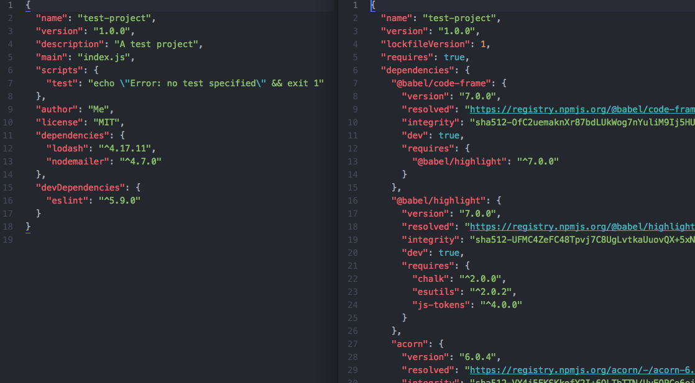

## Server-Side Programming & Node.js


# 2.3: Packages & Package Managers


- Learning Goals
- Introduction
- Package Managers
- Understanding Packages and Modules
- Understanding Dependencies
- npm
- Working with “package.json”
- Global and Local Installation
- Uninstalling Packages
- Bulk-Installing Packages
- Updating Packages
- How to Use Semantic Versioning (SemVer)
- Summary
- Resources
- Task
- Forum


#### Learning Goals


- Describe how to use package managers when working on server-side projects
- Install necessary packages for building an API with Node.js


#### Introduction

Hello again, and welcome to the third Exercise of Achievement 2, where you’ll dive deeper into Node.js, the preeminent JavaScript server-side runtime environment. In the previous Exercise, you were introduced to modules, the cogs that make Node work. Modules are separate pieces of JavaScript code you can “plug in” to your main app to add various functionalities, for instance, the ability to create a web server or read and parse URLs. You also learned how to import and export modules and their key functions, objects, and values.

The modules you’ve explored thus far have all been built-in modules (i.e., they come prepackaged with Node). In this Exercise, you’ll learn how to make use of third party (community-based) modules in your project to further extend the capabilities of your app. These third party modules are known as “packages,” and they come with a few extra rules than the built-in modules you already know. For this reason, we'll introduce you to a new tool, a Node package manager, which will allow you to install, uninstall, and update packages. Ready to go? Then, let’s get started!


#### Package Managers

When Node was first conceived back in 2009, it was solely intended as a server environment for JavaScript applications, in other words, a place where developers could build server-side networking applications using JavaScript. Since then, however, many developers have created new tools to be used in conjunction with Node, aiding them in the creation of their own apps.

This has paved the way for an entirely new ecosystem of JavaScript and Node-based tools (such as Express, Lodash, Nodemailer, Formidable, and ESLint). With these tools, developers no longer have to “recreate the wheel” every time they create a web application; rather, they can simply plug in a custom module, or “package,” created by one of their peers to attain the desired functionality in their app.

Lodash, for example, is a popular package that makes it easier for developers to work with arrays, numbers, objects, and more within JavaScript (something that has traditionally been inconvenient, as JavaScript is a functional programming language rather than an object-oriented one, as you learned back in Achievement 1).


> Module vs. Package
> What’s the difference between modules and packages? Technically, they’re both the same thing: a separate piece of JavaScript code that achieves a specific purpose and can be imported into your app to add various functionalities. However, a package explicitly denotes a third party (or community-based) module. Once a developer has created a new module, they can release it to a repository where other developers can download and use it. The published module is referred to as a package, and it needs to be installed before it can be used in your app. You’ll learn more about this below.

Unlike the modules you learned about in the previous Exercise, third party packages don’t come built into Node. This means they need to be downloaded and installed before they can be used (required). As you can imagine, organizing and managing all of your packages can start to get a bit cumbersome, especially if you elect to use a wide variety of packages. For this reason, Node package managers have become almost essential to a Node developer’s work.

Package managers are a collection of tools used to install, update, and configure the packages in a Node project. Think of them a bit like an administrative assistant. In an office environment, you might hire an administrative assistant to keep track of all your accounts, ensuring they’re properly added to your books and kept up-to-date so that you don’t have to and can concentrate on other tasks. You trust your administrative assistant to let you know if anything has changed within your accounts and update them accordingly. Your package manager is exactly the same, managing all of your packages and ensuring they’re kept up-to-date so you don’t have to manually install and update them. This not only saves you a lot of time but also prevents issues that may arise in your app from out-of-date packages.


#### Understanding Packages and Modules

We touched on the main difference between modules and packages earlier (packages are essentially third party modules). But before diving much deeper into the world of packages, let’s make sure you’ve covered all the specific rules when it comes to understanding and using them (and how those rules differ from those of modules). Node actually has very explicit definitions when it comes to modules and packages. Let’s take a look:

Modules

A module is anything that can be loaded using the `require()` function. This may be:


- A single JavaScript file
- A folder that includes an “index.js” file
- A folder that includes a “package.json” file (i.e., a package)

Packages

A package must contain a “package.json” file. This may be:


- A third party module (loaded as all modules are, with require())
- Published to the JavaScript Package Registry
- A command line script. These can’t be loaded with require() (and, thus, aren’t actually modules)

Packages generally need to be loaded via the `require()` function, making them modules. For example, grunt-package is a third party tool that can be loaded via the `require()` function, making it a module; however, not all packages are modules. CLI packages such as `grunt-cli`, for example, can’t be loaded with `require()` and, therefore, aren’t modules.

To sum it up, not all modules are packages, but most packages are modules. Think about it like tech companies: not all of them are in Silicon Valley, but most certainly are!


#### Understanding Dependencies

Before moving on, it’s vital that you understand why it’s important to keep your packages organized (and, more importantly, up-to-date). This is because each package you add to your app becomes a dependency of that app. A dependency is anything your project depends upon—whether that’s a library package like jQuery or a tool package like ESLint (both of which you learned about in the previous Achievement).

These dependencies were created by someone else; thus, their management, maintenance, and updating is also handled by someone else. If you use one of them in your app, and without your noticing, the creator updates its dependency, it may no longer work in your app. This is why it’s so important to have a package manager that automatically checks and ensures all of your packages (i.e., dependencies) are up-to-date. After all, you don’t want your app to break, especially after it’s been released to your users.

Let’s take an analogy to understand dependencies. At your bakery you sell banana bread, that your customers like a lot. You use a specific butter in your recipe. One day, the company that manufactures that butter decides to modify its ingredients. That means the taste of the butter you use changes, which changes the taste of your banana bread. You weren't aware of the change in ingredients of the butter, which resulted in the change in taste of your banana cake. Now your customers are unhappy. If you had someone to keep track of this information, you would have been careful and planned for a solution. That “someone” is the package manager.

Where it really becomes tricky is when your dependencies have dependencies of their own. For instance, your API project will make use of (depend upon) the ESLint package. However, ESLint makes use of (depends upon) a whopping 38 additional packages (see the “Dependencies” tab on the [ESLint package page](https://www.npmjs.com/package/eslint)). This means that your app is also dependent upon those 38 additional packages. What’s more, those 38 additional packages could have dependencies of their own, further adding to the total dependencies of your app. What started as one dependency can quickly multiply to 30, 50, or even 100 different dependencies!

When you install packages manually, you become the one responsible for making sure all of their dependencies are installed, as well. For instance, if you were to install ESLint manually, you’d also have to install each of its 38 dependencies. Then, you’d need to check each of those 38 dependencies and install all of their dependencies, too. You’d end up stuck installing dependencies for hours! This is where package managers play their key role, as they can automatically detect and install dependencies for you. When you install ESLint with a package manager, it automatically installs its 38 dependencies, as well as any dependencies of those dependencies it can find. That’s a lot of time saved!

Now that you know just how essential package managers can be when working with Node, let’s take a look at two of the most popular Node package managers out there: npm and Yarn.


#### npm

npm is the default Node package manager for Node.js. In fact, it was installed automatically with your installation of Node. npm consists of three distinct components: the [npm website](https://npmjs.com/), the [npm CLI](https://docs.npmjs.com/cli/npm) (which you’ll use every time you type `npm` commands into your terminal), and the [npm JavaScript Package Registry](https://docs.npmjs.com/misc/registry), a large, public database of JavaScript packages.

While the registry can be accessed via the command line interface (CLI), it’s easier to browse packages on the npm website. You can easily search for packages using the search bar at the top of the page.


> Take a look at the top bar of your screen while on the npm site. You may notice odd, randomized phrases starting with the letters n, p, and m, such as “Nineties Party Mix.” This is npm’s attempt to demonstrate that, despite popular belief, “npm” does not stand for “node package manager.” In fact, it doesn’t stand for anything—it’s simply a command. You can even contribute your own three-word npm phrases!

npm’s main advantage lies in its ability to install every one of your local dependencies for a particular project with a single command. This not only saves you time but prevents errors, as well. (You’ll learn more about installing packages later on in this Exercise.)

As npm comes packaged with Node.js when you install it using nvm, you should already have it installed on your machine. You might also want to check which version of npm you have installed. If you just installed Node recently using nvm, then it's likely your current version is the most up-to-date. To check your current version, simply type the following command into your terminal:

`npm -v`.

Here's a video walkthrough of how npm works:

Click for sound
  @keyframes VOLUME_SMALL_WAVE_FLASH {
    0% { opacity: 0; }
    33% { opacity: 1; }
    66% { opacity: 1; }
    100% { opacity: 0; }
  }

  @keyframes VOLUME_LARGE_WAVE_FLASH {
    0% { opacity: 0; }
    33% { opacity: 1; }
    66% { opacity: 1; }
    100% { opacity: 0; }
  }

  .volume__small-wave {
    animation: VOLUME_SMALL_WAVE_FLASH 2s infinite;
    opacity: 0;
  }

  .volume__large-wave {
    animation: VOLUME_LARGE_WAVE_FLASH 2s infinite .3s;
    opacity: 0;
  }
0:54
        @media (prefers-reduced-motion: no-preference) {
          @keyframes w-control-bar-fade-in {
            0% {
              opacity: 0;
              transform: translateX(50%) translateY(10px);
            }
            100% {
              opacity: 1;
              transform: translateX(50%) translateY(0px);
            }
          }
        }
      
      #wistia_chrome_23 #wistia_grid_43_wrapper .w-css-reset{font-size:14px;}
#wistia_chrome_23 #wistia_grid_43_wrapper div.w-css-reset{box-sizing:inherit;box-shadow:none;color:inherit;display:block;float:none;font:inherit;font-family:inherit;font-style:normal;font-weight:normal;font-size:inherit;letter-spacing:0;line-height:inherit;margin:0;max-height:none;max-width:none;min-height:0;min-width:0;padding:0;position:static;text-decoration:none;text-transform:none;text-shadow:none;transition:none;word-wrap:normal;-webkit-tap-highlight-color:rgba(0,0,0,0);-webkit-user-select:none;-webkit-font-smoothing:antialiased}
#wistia_chrome_23 #wistia_grid_43_wrapper span.w-css-reset{box-sizing:inherit;box-shadow:none;color:inherit;display:block;float:none;font:inherit;font-family:inherit;font-style:normal;font-weight:normal;font-size:inherit;letter-spacing:0;line-height:inherit;margin:0;max-height:none;max-width:none;min-height:0;min-width:0;padding:0;position:static;text-decoration:none;text-transform:none;text-shadow:none;transition:none;word-wrap:normal;-webkit-tap-highlight-color:rgba(0,0,0,0);-webkit-user-select:none;-webkit-font-smoothing:antialiased}
#wistia_chrome_23 #wistia_grid_43_wrapper ul.w-css-reset{box-sizing:inherit;box-shadow:none;color:inherit;display:block;float:none;font:inherit;font-family:inherit;font-style:normal;font-weight:normal;font-size:inherit;letter-spacing:0;line-height:inherit;margin:0;max-height:none;max-width:none;min-height:0;min-width:0;padding:0;position:static;text-decoration:none;text-transform:none;text-shadow:none;transition:none;word-wrap:normal;-webkit-tap-highlight-color:rgba(0,0,0,0);-webkit-user-select:none;-webkit-font-smoothing:antialiased}
#wistia_chrome_23 #wistia_grid_43_wrapper li.w-css-reset{box-sizing:inherit;box-shadow:none;color:inherit;display:block;float:none;font:inherit;font-family:inherit;font-style:normal;font-weight:normal;font-size:inherit;letter-spacing:0;line-height:inherit;margin:0;max-height:none;max-width:none;min-height:0;min-width:0;padding:0;position:static;text-decoration:none;text-transform:none;text-shadow:none;transition:none;word-wrap:normal;-webkit-tap-highlight-color:rgba(0,0,0,0);-webkit-user-select:none;-webkit-font-smoothing:antialiased}
#wistia_chrome_23 #wistia_grid_43_wrapper label.w-css-reset{box-sizing:inherit;box-shadow:none;color:inherit;display:block;float:none;font:inherit;font-family:inherit;font-style:normal;font-weight:normal;font-size:inherit;letter-spacing:0;line-height:inherit;margin:0;max-height:none;max-width:none;min-height:0;min-width:0;padding:0;position:static;text-decoration:none;text-transform:none;text-shadow:none;transition:none;word-wrap:normal;-webkit-tap-highlight-color:rgba(0,0,0,0);-webkit-user-select:none;-webkit-font-smoothing:antialiased}
#wistia_chrome_23 #wistia_grid_43_wrapper fieldset.w-css-reset{box-sizing:inherit;box-shadow:none;color:inherit;display:block;float:none;font:inherit;font-family:inherit;font-style:normal;font-weight:normal;font-size:inherit;letter-spacing:0;line-height:inherit;margin:0;max-height:none;max-width:none;min-height:0;min-width:0;padding:0;position:static;text-decoration:none;text-transform:none;text-shadow:none;transition:none;word-wrap:normal;-webkit-tap-highlight-color:rgba(0,0,0,0);-webkit-user-select:none;-webkit-font-smoothing:antialiased}
#wistia_chrome_23 #wistia_grid_43_wrapper button.w-css-reset{box-sizing:inherit;box-shadow:none;color:inherit;display:block;float:none;font:inherit;font-family:inherit;font-style:normal;font-weight:normal;font-size:inherit;letter-spacing:0;line-height:inherit;margin:0;max-height:none;max-width:none;min-height:0;min-width:0;padding:0;position:static;text-decoration:none;text-transform:none;text-shadow:none;transition:none;word-wrap:normal;-webkit-tap-highlight-color:rgba(0,0,0,0);-webkit-user-select:none;-webkit-font-smoothing:antialiased}
#wistia_chrome_23 #wistia_grid_43_wrapper img.w-css-reset{box-sizing:inherit;box-shadow:none;color:inherit;display:block;float:none;font:inherit;font-family:inherit;font-style:normal;font-weight:normal;font-size:inherit;letter-spacing:0;line-height:inherit;margin:0;max-height:none;max-width:none;min-height:0;min-width:0;padding:0;position:static;text-decoration:none;text-transform:none;text-shadow:none;transition:none;word-wrap:normal;-webkit-tap-highlight-color:rgba(0,0,0,0);-webkit-user-select:none;-webkit-font-smoothing:antialiased}
#wistia_chrome_23 #wistia_grid_43_wrapper a.w-css-reset{box-sizing:inherit;box-shadow:none;color:inherit;display:block;float:none;font:inherit;font-family:inherit;font-style:normal;font-weight:normal;font-size:inherit;letter-spacing:0;line-height:inherit;margin:0;max-height:none;max-width:none;min-height:0;min-width:0;padding:0;position:static;text-decoration:none;text-transform:none;text-shadow:none;transition:none;word-wrap:normal;-webkit-tap-highlight-color:rgba(0,0,0,0);-webkit-user-select:none;-webkit-font-smoothing:antialiased}
#wistia_chrome_23 #wistia_grid_43_wrapper svg.w-css-reset{box-sizing:inherit;box-shadow:none;color:inherit;display:block;float:none;font:inherit;font-family:inherit;font-style:normal;font-weight:normal;font-size:inherit;letter-spacing:0;line-height:inherit;margin:0;max-height:none;max-width:none;min-height:0;min-width:0;padding:0;position:static;text-decoration:none;text-transform:none;text-shadow:none;transition:none;word-wrap:normal;-webkit-tap-highlight-color:rgba(0,0,0,0);-webkit-user-select:none;-webkit-font-smoothing:antialiased}
#wistia_chrome_23 #wistia_grid_43_wrapper p.w-css-reset{box-sizing:inherit;box-shadow:none;color:inherit;display:block;float:none;font:inherit;font-family:inherit;font-style:normal;font-weight:normal;font-size:inherit;letter-spacing:0;line-height:inherit;margin:0;max-height:none;max-width:none;min-height:0;min-width:0;padding:0;position:static;text-decoration:none;text-transform:none;text-shadow:none;transition:none;word-wrap:normal;-webkit-tap-highlight-color:rgba(0,0,0,0);-webkit-user-select:none;-webkit-font-smoothing:antialiased}
#wistia_chrome_23 #wistia_grid_43_wrapper a.w-css-reset{border:0;}
#wistia_chrome_23 #wistia_grid_43_wrapper h1.w-css-reset{box-sizing:inherit;box-shadow:none;color:inherit;display:block;float:none;font:inherit;font-family:inherit;font-style:normal;font-weight:normal;font-size:2em;letter-spacing:0;line-height:inherit;margin:0;max-height:none;max-width:none;min-height:0;min-width:0;padding:0;position:static;text-decoration:none;text-transform:none;text-shadow:none;transition:none;word-wrap:normal;-webkit-tap-highlight-color:rgba(0,0,0,0);-webkit-user-select:none;-webkit-font-smoothing:antialiased}
#wistia_chrome_23 #wistia_grid_43_wrapper h2.w-css-reset{box-sizing:inherit;box-shadow:none;color:inherit;display:block;float:none;font:inherit;font-family:inherit;font-style:normal;font-weight:normal;font-size:1.5em;letter-spacing:0;line-height:inherit;margin:0;max-height:none;max-width:none;min-height:0;min-width:0;padding:0;position:static;text-decoration:none;text-transform:none;text-shadow:none;transition:none;word-wrap:normal;-webkit-tap-highlight-color:rgba(0,0,0,0);-webkit-user-select:none;-webkit-font-smoothing:antialiased}
#wistia_chrome_23 #wistia_grid_43_wrapper h3.w-css-reset{box-sizing:inherit;box-shadow:none;color:inherit;display:block;float:none;font:inherit;font-family:inherit;font-style:normal;font-weight:normal;font-size:1.17em;letter-spacing:0;line-height:inherit;margin:0;max-height:none;max-width:none;min-height:0;min-width:0;padding:0;position:static;text-decoration:none;text-transform:none;text-shadow:none;transition:none;word-wrap:normal;-webkit-tap-highlight-color:rgba(0,0,0,0);-webkit-user-select:none;-webkit-font-smoothing:antialiased}
#wistia_chrome_23 #wistia_grid_43_wrapper p.w-css-reset{margin:1.4em 0;}
#wistia_chrome_23 #wistia_grid_43_wrapper a.w-css-reset{display:inline;}
#wistia_chrome_23 #wistia_grid_43_wrapper span.w-css-reset{display:inline;}
#wistia_chrome_23 #wistia_grid_43_wrapper svg.w-css-reset{display:inline;}
#wistia_chrome_23 #wistia_grid_43_wrapper ul.w-css-reset{box-sizing:inherit;box-shadow:none;color:inherit;display:block;float:none;font:inherit;font-family:inherit;font-style:normal;font-weight:normal;font-size:inherit;letter-spacing:0;line-height:inherit;margin:0;max-height:none;max-width:none;min-height:0;min-width:0;padding:0;position:static;text-decoration:none;text-transform:none;text-shadow:none;transition:none;word-wrap:normal;-webkit-tap-highlight-color:rgba(0,0,0,0);-webkit-user-select:none;-webkit-font-smoothing:antialiased;list-style-type:none}
#wistia_chrome_23 #wistia_grid_43_wrapper ol.w-css-reset{box-sizing:inherit;box-shadow:none;color:inherit;display:block;float:none;font:inherit;font-family:inherit;font-style:normal;font-weight:normal;font-size:inherit;letter-spacing:0;line-height:inherit;margin:0;max-height:none;max-width:none;min-height:0;min-width:0;padding:0;position:static;text-decoration:none;text-transform:none;text-shadow:none;transition:none;word-wrap:normal;-webkit-tap-highlight-color:rgba(0,0,0,0);-webkit-user-select:none;-webkit-font-smoothing:antialiased;list-style-type:none}
#wistia_chrome_23 #wistia_grid_43_wrapper li.w-css-reset{box-sizing:inherit;box-shadow:none;color:inherit;display:block;float:none;font:inherit;font-family:inherit;font-style:normal;font-weight:normal;font-size:inherit;letter-spacing:0;line-height:inherit;margin:0;max-height:none;max-width:none;min-height:0;min-width:0;padding:0;position:static;text-decoration:none;text-transform:none;text-shadow:none;transition:none;word-wrap:normal;-webkit-tap-highlight-color:rgba(0,0,0,0);-webkit-user-select:none;-webkit-font-smoothing:antialiased;list-style-type:none}
#wistia_chrome_23 #wistia_grid_43_wrapper ul:before.w-css-reset{display:none}
#wistia_chrome_23 #wistia_grid_43_wrapper ol:before.w-css-reset{display:none}
#wistia_chrome_23 #wistia_grid_43_wrapper li:before.w-css-reset{display:none}
#wistia_chrome_23 #wistia_grid_43_wrapper ul:after.w-css-reset{display:none}
#wistia_chrome_23 #wistia_grid_43_wrapper ol:after.w-css-reset{display:none}
#wistia_chrome_23 #wistia_grid_43_wrapper li:after.w-css-reset{display:none}
#wistia_chrome_23 #wistia_grid_43_wrapper label.w-css-reset{background-attachment:scroll;background-color:transparent;background-image:none;background-position:0 0;background-repeat:no-repeat;background-size:100% 100%;float:none;outline:none}
#wistia_chrome_23 #wistia_grid_43_wrapper button.w-css-reset{background-attachment:scroll;background-color:transparent;background-image:none;background-position:0 0;background-repeat:no-repeat;background-size:100% 100%;border:0;border-radius:0;outline:none;position:static}
#wistia_chrome_23 #wistia_grid_43_wrapper img.w-css-reset{border:0;display:inline-block;vertical-align:top;border-radius:0;outline:none;position:static}
#wistia_chrome_23 #wistia_grid_43_wrapper .w-css-reset button::-moz-focus-inner{border: 0;}
      #wistia_chrome_23 #wistia_grid_43_wrapper .w-css-reset-tree {font-size:14px;}
#wistia_chrome_23 #wistia_grid_43_wrapper .w-css-reset-tree div{box-sizing:inherit;box-shadow:none;color:inherit;display:block;float:none;font:inherit;font-family:inherit;font-style:normal;font-weight:normal;font-size:inherit;letter-spacing:0;line-height:inherit;margin:0;max-height:none;max-width:none;min-height:0;min-width:0;padding:0;position:static;text-decoration:none;text-transform:none;text-shadow:none;transition:none;word-wrap:normal;-webkit-tap-highlight-color:rgba(0,0,0,0);-webkit-user-select:none;-webkit-font-smoothing:antialiased}
#wistia_chrome_23 #wistia_grid_43_wrapper .w-css-reset-tree span{box-sizing:inherit;box-shadow:none;color:inherit;display:block;float:none;font:inherit;font-family:inherit;font-style:normal;font-weight:normal;font-size:inherit;letter-spacing:0;line-height:inherit;margin:0;max-height:none;max-width:none;min-height:0;min-width:0;padding:0;position:static;text-decoration:none;text-transform:none;text-shadow:none;transition:none;word-wrap:normal;-webkit-tap-highlight-color:rgba(0,0,0,0);-webkit-user-select:none;-webkit-font-smoothing:antialiased}
#wistia_chrome_23 #wistia_grid_43_wrapper .w-css-reset-tree ul{box-sizing:inherit;box-shadow:none;color:inherit;display:block;float:none;font:inherit;font-family:inherit;font-style:normal;font-weight:normal;font-size:inherit;letter-spacing:0;line-height:inherit;margin:0;max-height:none;max-width:none;min-height:0;min-width:0;padding:0;position:static;text-decoration:none;text-transform:none;text-shadow:none;transition:none;word-wrap:normal;-webkit-tap-highlight-color:rgba(0,0,0,0);-webkit-user-select:none;-webkit-font-smoothing:antialiased}
#wistia_chrome_23 #wistia_grid_43_wrapper .w-css-reset-tree li{box-sizing:inherit;box-shadow:none;color:inherit;display:block;float:none;font:inherit;font-family:inherit;font-style:normal;font-weight:normal;font-size:inherit;letter-spacing:0;line-height:inherit;margin:0;max-height:none;max-width:none;min-height:0;min-width:0;padding:0;position:static;text-decoration:none;text-transform:none;text-shadow:none;transition:none;word-wrap:normal;-webkit-tap-highlight-color:rgba(0,0,0,0);-webkit-user-select:none;-webkit-font-smoothing:antialiased}
#wistia_chrome_23 #wistia_grid_43_wrapper .w-css-reset-tree label{box-sizing:inherit;box-shadow:none;color:inherit;display:block;float:none;font:inherit;font-family:inherit;font-style:normal;font-weight:normal;font-size:inherit;letter-spacing:0;line-height:inherit;margin:0;max-height:none;max-width:none;min-height:0;min-width:0;padding:0;position:static;text-decoration:none;text-transform:none;text-shadow:none;transition:none;word-wrap:normal;-webkit-tap-highlight-color:rgba(0,0,0,0);-webkit-user-select:none;-webkit-font-smoothing:antialiased}
#wistia_chrome_23 #wistia_grid_43_wrapper .w-css-reset-tree fieldset{box-sizing:inherit;box-shadow:none;color:inherit;display:block;float:none;font:inherit;font-family:inherit;font-style:normal;font-weight:normal;font-size:inherit;letter-spacing:0;line-height:inherit;margin:0;max-height:none;max-width:none;min-height:0;min-width:0;padding:0;position:static;text-decoration:none;text-transform:none;text-shadow:none;transition:none;word-wrap:normal;-webkit-tap-highlight-color:rgba(0,0,0,0);-webkit-user-select:none;-webkit-font-smoothing:antialiased}
#wistia_chrome_23 #wistia_grid_43_wrapper .w-css-reset-tree button{box-sizing:inherit;box-shadow:none;color:inherit;display:block;float:none;font:inherit;font-family:inherit;font-style:normal;font-weight:normal;font-size:inherit;letter-spacing:0;line-height:inherit;margin:0;max-height:none;max-width:none;min-height:0;min-width:0;padding:0;position:static;text-decoration:none;text-transform:none;text-shadow:none;transition:none;word-wrap:normal;-webkit-tap-highlight-color:rgba(0,0,0,0);-webkit-user-select:none;-webkit-font-smoothing:antialiased}
#wistia_chrome_23 #wistia_grid_43_wrapper .w-css-reset-tree img{box-sizing:inherit;box-shadow:none;color:inherit;display:block;float:none;font:inherit;font-family:inherit;font-style:normal;font-weight:normal;font-size:inherit;letter-spacing:0;line-height:inherit;margin:0;max-height:none;max-width:none;min-height:0;min-width:0;padding:0;position:static;text-decoration:none;text-transform:none;text-shadow:none;transition:none;word-wrap:normal;-webkit-tap-highlight-color:rgba(0,0,0,0);-webkit-user-select:none;-webkit-font-smoothing:antialiased}
#wistia_chrome_23 #wistia_grid_43_wrapper .w-css-reset-tree a{box-sizing:inherit;box-shadow:none;color:inherit;display:block;float:none;font:inherit;font-family:inherit;font-style:normal;font-weight:normal;font-size:inherit;letter-spacing:0;line-height:inherit;margin:0;max-height:none;max-width:none;min-height:0;min-width:0;padding:0;position:static;text-decoration:none;text-transform:none;text-shadow:none;transition:none;word-wrap:normal;-webkit-tap-highlight-color:rgba(0,0,0,0);-webkit-user-select:none;-webkit-font-smoothing:antialiased}
#wistia_chrome_23 #wistia_grid_43_wrapper .w-css-reset-tree svg{box-sizing:inherit;box-shadow:none;color:inherit;display:block;float:none;font:inherit;font-family:inherit;font-style:normal;font-weight:normal;font-size:inherit;letter-spacing:0;line-height:inherit;margin:0;max-height:none;max-width:none;min-height:0;min-width:0;padding:0;position:static;text-decoration:none;text-transform:none;text-shadow:none;transition:none;word-wrap:normal;-webkit-tap-highlight-color:rgba(0,0,0,0);-webkit-user-select:none;-webkit-font-smoothing:antialiased}
#wistia_chrome_23 #wistia_grid_43_wrapper .w-css-reset-tree p{box-sizing:inherit;box-shadow:none;color:inherit;display:block;float:none;font:inherit;font-family:inherit;font-style:normal;font-weight:normal;font-size:inherit;letter-spacing:0;line-height:inherit;margin:0;max-height:none;max-width:none;min-height:0;min-width:0;padding:0;position:static;text-decoration:none;text-transform:none;text-shadow:none;transition:none;word-wrap:normal;-webkit-tap-highlight-color:rgba(0,0,0,0);-webkit-user-select:none;-webkit-font-smoothing:antialiased}
#wistia_chrome_23 #wistia_grid_43_wrapper .w-css-reset-tree a{border:0;}
#wistia_chrome_23 #wistia_grid_43_wrapper .w-css-reset-tree h1{box-sizing:inherit;box-shadow:none;color:inherit;display:block;float:none;font:inherit;font-family:inherit;font-style:normal;font-weight:normal;font-size:2em;letter-spacing:0;line-height:inherit;margin:0;max-height:none;max-width:none;min-height:0;min-width:0;padding:0;position:static;text-decoration:none;text-transform:none;text-shadow:none;transition:none;word-wrap:normal;-webkit-tap-highlight-color:rgba(0,0,0,0);-webkit-user-select:none;-webkit-font-smoothing:antialiased}
#wistia_chrome_23 #wistia_grid_43_wrapper .w-css-reset-tree h2{box-sizing:inherit;box-shadow:none;color:inherit;display:block;float:none;font:inherit;font-family:inherit;font-style:normal;font-weight:normal;font-size:1.5em;letter-spacing:0;line-height:inherit;margin:0;max-height:none;max-width:none;min-height:0;min-width:0;padding:0;position:static;text-decoration:none;text-transform:none;text-shadow:none;transition:none;word-wrap:normal;-webkit-tap-highlight-color:rgba(0,0,0,0);-webkit-user-select:none;-webkit-font-smoothing:antialiased}
#wistia_chrome_23 #wistia_grid_43_wrapper .w-css-reset-tree h3{box-sizing:inherit;box-shadow:none;color:inherit;display:block;float:none;font:inherit;font-family:inherit;font-style:normal;font-weight:normal;font-size:1.17em;letter-spacing:0;line-height:inherit;margin:0;max-height:none;max-width:none;min-height:0;min-width:0;padding:0;position:static;text-decoration:none;text-transform:none;text-shadow:none;transition:none;word-wrap:normal;-webkit-tap-highlight-color:rgba(0,0,0,0);-webkit-user-select:none;-webkit-font-smoothing:antialiased}
#wistia_chrome_23 #wistia_grid_43_wrapper .w-css-reset-tree p{margin:1.4em 0;}
#wistia_chrome_23 #wistia_grid_43_wrapper .w-css-reset-tree a{display:inline;}
#wistia_chrome_23 #wistia_grid_43_wrapper .w-css-reset-tree span{display:inline;}
#wistia_chrome_23 #wistia_grid_43_wrapper .w-css-reset-tree svg{display:inline;}
#wistia_chrome_23 #wistia_grid_43_wrapper .w-css-reset-tree ul{box-sizing:inherit;box-shadow:none;color:inherit;display:block;float:none;font:inherit;font-family:inherit;font-style:normal;font-weight:normal;font-size:inherit;letter-spacing:0;line-height:inherit;margin:0;max-height:none;max-width:none;min-height:0;min-width:0;padding:0;position:static;text-decoration:none;text-transform:none;text-shadow:none;transition:none;word-wrap:normal;-webkit-tap-highlight-color:rgba(0,0,0,0);-webkit-user-select:none;-webkit-font-smoothing:antialiased;list-style-type:none}
#wistia_chrome_23 #wistia_grid_43_wrapper .w-css-reset-tree ol{box-sizing:inherit;box-shadow:none;color:inherit;display:block;float:none;font:inherit;font-family:inherit;font-style:normal;font-weight:normal;font-size:inherit;letter-spacing:0;line-height:inherit;margin:0;max-height:none;max-width:none;min-height:0;min-width:0;padding:0;position:static;text-decoration:none;text-transform:none;text-shadow:none;transition:none;word-wrap:normal;-webkit-tap-highlight-color:rgba(0,0,0,0);-webkit-user-select:none;-webkit-font-smoothing:antialiased;list-style-type:none}
#wistia_chrome_23 #wistia_grid_43_wrapper .w-css-reset-tree li{box-sizing:inherit;box-shadow:none;color:inherit;display:block;float:none;font:inherit;font-family:inherit;font-style:normal;font-weight:normal;font-size:inherit;letter-spacing:0;line-height:inherit;margin:0;max-height:none;max-width:none;min-height:0;min-width:0;padding:0;position:static;text-decoration:none;text-transform:none;text-shadow:none;transition:none;word-wrap:normal;-webkit-tap-highlight-color:rgba(0,0,0,0);-webkit-user-select:none;-webkit-font-smoothing:antialiased;list-style-type:none}
#wistia_chrome_23 #wistia_grid_43_wrapper .w-css-reset-tree ul:before{display:none}
#wistia_chrome_23 #wistia_grid_43_wrapper .w-css-reset-tree ol:before{display:none}
#wistia_chrome_23 #wistia_grid_43_wrapper .w-css-reset-tree li:before{display:none}
#wistia_chrome_23 #wistia_grid_43_wrapper .w-css-reset-tree ul:after{display:none}
#wistia_chrome_23 #wistia_grid_43_wrapper .w-css-reset-tree ol:after{display:none}
#wistia_chrome_23 #wistia_grid_43_wrapper .w-css-reset-tree li:after{display:none}
#wistia_chrome_23 #wistia_grid_43_wrapper .w-css-reset-tree label{background-attachment:scroll;background-color:transparent;background-image:none;background-position:0 0;background-repeat:no-repeat;background-size:100% 100%;float:none;outline:none}
#wistia_chrome_23 #wistia_grid_43_wrapper .w-css-reset-tree button{background-attachment:scroll;background-color:transparent;background-image:none;background-position:0 0;background-repeat:no-repeat;background-size:100% 100%;border:0;border-radius:0;outline:none;position:static}
#wistia_chrome_23 #wistia_grid_43_wrapper .w-css-reset-tree img{border:0;display:inline-block;vertical-align:top;border-radius:0;outline:none;position:static}
#wistia_chrome_23 #wistia_grid_43_wrapper .w-css-reset-tree  button::-moz-focus-inner{border: 0;}
      #wistia_chrome_23 #wistia_grid_43_wrapper .w-css-reset-max-width-none-important{max-width:none!important}
      #wistia_chrome_23 #wistia_grid_43_wrapper .w-css-reset-button-important{border-radius:0!important;color:#fff!important;}
    #wistia_grid_43_wrapper{-moz-box-sizing:content-box;-webkit-box-sizing:content-box;box-sizing:content-box;font-family:Arial,sans-serif;font-size:14px;height:100%;position:relative;text-align:left;width:100%;}
#wistia_grid_43_wrapper *{-moz-box-sizing:content-box;-webkit-box-sizing:content-box;box-sizing:content-box;}
#wistia_grid_43_above{position:relative;}
#wistia_grid_43_main{display:block;height:100%;position:relative;}
#wistia_grid_43_behind{height:100%;left:0;position:absolute;top:0;width:100%;}
#wistia_grid_43_center{height:100%;overflow:hidden;position:relative;width:100%;}
#wistia_grid_43_front{display:none;height:100%;left:0;position:absolute;top:0;width:100%;}
#wistia_grid_43_top_inside{position:absolute;left:0;top:0;width:100%;}
#wistia_grid_43_top{width:100%;position:absolute;bottom:0;left:0;}
#wistia_grid_43_bottom_inside{position:absolute;left:0;bottom:0;width:100%;}
#wistia_grid_43_bottom{width:100%;position:absolute;top:0;left:0;}
#wistia_grid_43_left_inside{height:100%;position:absolute;left:0;top:0;}
#wistia_grid_43_left{height:100%;position:absolute;right:0;top:0;}
#wistia_grid_43_right_inside{height:100%;right:0;position:absolute;top:0;}
#wistia_grid_43_right{height:100%;left:0;position:absolute;top:0;}
#wistia_grid_43_below{position:relative;}


> Errors When Installing with npm on Windows Machines
> If you try to run the above npm install -g npm command in your Ubuntu terminal on a Windows machine, you may end up with the error "Error: EACCES: permission denied, access '/usr/local/lib/". This happens when the location npm is installed in is owned by the "root" administrator of your computer rather than the user you're currently logged in as. The easiest way to fix this is by changing the permissions for this folder.
> 
> Start by checking the ownership of the "/usr/local/lib" to see if it's, indeed, owned by the root folder with the following command:
> 
> ls -la /usr/local/lib/node_modules
> 
> You'll also want to confirm the user you're currently logged in as. You can do this via the command:
> 
> id -un
> 
> Finally, change ownership of the "/usr/local/lib" folder to your current user via the command:
> 
> sudo chown -R currentuser:currentuser /usr/local/lib
> 
> Make sure you replace "currentuser" in both places in the command above with the name of the user that was returned from the id -un command. Once doing this, try the npm install -g npm command again. If you still receive an error, there may be other folders that need permission, as well (e.g., the "/usr/local/bin" folder), so repeat the steps above for any additional folders listed in the error message. Once all necessary folders have been given permission, you should be able to perform the npm install -g npm command successfully.

npm isn’t your only option when it comes to package management. One alternative you might explore is Facebook’s package management solution, [Yarn](https://yarnpkg.com/en/). Like npm, Yarn is a package manager for JavaScript, and while it does a few things differently than npm, they’re otherwise pretty similar.

While you won’t be using Yarn in this course, feel free to learn more about it and how it compares to npm by checking out this [Yarn vs. npm tutorial](https://blog.risingstack.com/yarn-vs-npm-node-js-package-managers/). You can also check out the [Yarn Getting Started documentation](https://yarnpkg.com/en/docs/getting-started) to get up to speed on its functions and processes.


##### Node.js Version Manager

Just as you use a Node package manager to keep all of your dependencies up-to-date, so, too, can you use a Node version manager to keep your copies of Node and npm up-to-date. This can save you a lot of time and energy, especially considering how often they’re releasing new, small updates to both tools. A great, simple, and lightweight manager is [Node Version Manager](https://github.com/creationix/nvm) (nvm), but there are a few others you can look into, including [nodist](https://github.com/marcelklehr/nodist), [n](https://github.com/tj/n), and [nave](https://github.com/isaacs/nave).

To install and run Node and npm on your machine using nvm, check out the following tutorials:


- Installing Node.js on Ubuntu using nvm
- Installing Node.js on macOS using nvm


#### Working with “package.json”

As mentioned earlier in this Exercise, a package is a file, directory, or module that contains a “package.json” file in its root folder. Check out the GitHub repo for any package in the JavaScript Package Registry and you’ll find this file. For instance, if you open up the [repo for the react module](https://github.com/facebook/react) and scroll down the list of folders and files, you’ll find “package.json” towards the bottom:


###### Figure 1

This “package.json” file is an essential part of a package as it’s used to manage those packages from the JavaScript Package Registry that you want to install for your project. It:


- Provides metadata about your package, such as its name, version, and license, as well as information about the author.
- Lists any other packages your project depends on.
- Supplies the specific versions of each of your package’s dependencies.

Let’s take a look at the [“package.json” file for a relatively small package, object-assign](https://github.com/sindresorhus/object-assign/blob/master/package.json). At the top of the file is the package’s metadata, which includes information about the package and its author:


###### Figure 2

You’ll also find information about the package’s engines, scripts, files, and keywords. Below all that, you’ll find its dependencies, which are listed with the version of each dependency required for the package to work properly. These are written according to semantic versioning rules, which you’ll be learning about later in this Exercise:


###### Figure 3

Most of the packages you’ll look up on the JavaScript Package Registry have fairly fleshed out “package.json” files; however, the only info that’s required in order to have a fully functioning “package.json” file is:


- "name"


all lowercase
one word (no spaces)
hyphens and underscores allowed
- "version"


following the form “x.x.x”

For example, a very simple “package.json” file could look like the following:


```js
{
  "name": "my-first-package",
  "version": "1.0.0"
}
```

As you’ll be making your own package shortly, it’s important that you know how to create your own “package.json” file to go with it. You can either create an immediate, automatic default file or a custom file that generates all the information after walking you through a questionnaire. Creating a custom “package.json” file is out of the scope of this course. Instead, you’ll simply be asked to create a default “package.json” file, and the steps for this are laid out below. But first, let’s quickly recap what you already know about JSON.


##### JSON Recap

In the last Achievement, you were introduced to JSON, or JavaScript Object Notation. To recap, JSON can almost be considered its own special language, used to transfer data back and forth between the server and a web application. If you’re going to be sending and receiving data from an external source, you’re almost guaranteed to need JSON. After all, just about any server you plan on interacting with in your future web development endeavors is going to use JSON. This is because servers can only store data in plain text, making the more advanced functionality of other programming languages incompatible.

For this same reason, all JSON data has to be in plain text. When writing JSON documentation, JSON objects are written in key-value pairs `[{"key1":"value1"},{"key2":"value2"}]` (note: this is an array of two objects), as in the example JSON above (which has been copied down below again for you). It supports strings, numbers, booleans, null, arrays, and sub-objects, all nested in arbitrary depth—meaning you can assign as many objects inside objects as you want. For example, in the code below, the different development dependencies (the keys “ava”, “lodash”, “matcha”, and “xo”, with their corresponding values) are nested within the “devDependencies” object:


###### Figure 4


> For more on JSON, check out this JSON Objects resource from W3Schools.


##### Creating a Default “package.json” File

It's quick and easy to create a default “package.json” file. Running the following code in your terminal will generate a new “package.json” file with information about the current directory:


```js
npm init --yes
```

or:


```js
npm init -y
```

This command will create the following default content (assuming your current directory is `my-first-package`):


```js
{
  "name": "my-first-package",
  "description": "",
  "version": "1.0.0",
  "main": "index.js",
  "scripts": {
    "test": "echo \"Error: no test specified\" && exit 1"
  },
  "repository": {
    "type": "git",
    "url": "https://github.com/johndoe/my-first-package.git"
  },
  "keywords": [],
  "author": "",
  "license": "ISC",
  "bugs": {
    "url": "https://github.com/johndoe/my-first-package/issues"
  },
  "homepage": "https://github.com/johndoe/my-first-package"
}
```

The addition of this “package.json” file has officially turned your “my-first-package” application into a package!


#### Global and Local Installation

Now that you have a “package.json” file, you can begin installing the packages your project will depend upon.

When dealing with npm packages, you have a few different options for how to install them: as local dependencies (to your specific project), as local dev dependencies (things you need just for development but don’t need for your app to actually run), or as global dependencies (things that help with the creation of the project). Your choice of installation option will depend on how you want to use the package.

Let’s take an example to understand these dependencies. There is a shopping complex in your town that houses several restaurants, and each has their own waiters and waitresses. You can think of the waiters and waitresses of a specific restaurant as being the local dependencies, since they're specific to that restaurant. Next, let’s assume that there is a single supplier company that supplies vegetables and meat to all those restaurants. The supplier can be treated as the global dependency, as all the restaurants depend on it. Then comes the cooking utensils in the restaurant kitchens. Those utensils are needed while preparing the orders, but they're not used while serving the food to customers. These cooking utensils are analogous to local dev dependencies.

Let’s take a closer look at these three options.


##### Global Dependency

Packages installed globally will be stored under the same directory in which Node was installed. Notably, this isn’t within your project’s directory because packages installed globally aren’t tied to a single project (and will work no matter which directory is current). Global installs are most suitable for node scripts that won’t be used directly inside an app but, rather, will expedite the creation and execution of the project (e.g., `npm` itself, which helps developers with the installation of packages, or `express-generator`, which generates the skeleton of an application to get developers started).

Installing npm packages globally requires a global flag, which is `-g` or `--global`. If you wanted to globally install `express-generator`, for example, the code would look like this:

`npm install --global express-generator`


> Note on Flags
> Flags are special arguments that alter the behavior of terminal commands. For example, attaching the --global flag to the npm install express command will install a module called express in a folder on your computer that’s accessible from any Node project on your system.
> 
> The plain npm install express command without the --global flag will install a module called express in the current folder, making it so that the module is only accessible within the context of that folder (as well as any nested folders).
> 
> Keep in mind that each terminal command can have a different set of flags.


##### Local Dependency

Anything that isn’t installed globally is installed locally into your project directory. Locally installed packages are either used at some point during the development process or are required for the app to work. This is, by far, the majority use case for npm packages. Any packages installed locally will be added to your “package.json” file and listed as project dependencies. They’re also the packages that you’ll be importing into your app via the require() function.

First, let’s look at the default local dependency. These are packages that will need to be distributed along with the rest of your project once it’s launched in order for the application to actually work—packages that are required at runtime.

Installing npm packages locally in this way is the default installation option for all packages and can be done via the following command (remember to navigate to your project directory first!):

`npm install [packageName]` (no flags needed)

Let’s try it out with `lodash`, the popular package mentioned earlier that makes it easier for developers to work with arrays, numbers, objects, and more within JavaScript. This will need to be installed as a default local dependency in order to use the lodash library methods in your own app code.

To install the package, type the following command in your terminal (making sure to install it into your project directory!):

`npm install lodash`

Now, if you open your “package.json” file, you’ll see a new section header labelled “dependencies” with “lodash” listed beneath.


> If you type the cat package.json command into your terminal, your “package.json” file will be read and displayed so you can view the updated “dependencies” section:


###### Figure 5

You might have also noticed a new “node_modules” folder in your project directory. If you open up this folder, you’ll see the new “lodash” folder that’s just been installed. The “node_modules” folder keeps track of all the locally installed packages you’re using for your app and pulls from this folder when incorporating the functionality into the application as needed. This folder allows for any of the app dependencies to shift out in the wild without completely breaking your application.

You might recognize the “node_modules” folder from when it was first mentioned in the previous Exercise. As a recap, when using the `require()` function to import a module, Node will first look for a built-in Node module with the name you provide. If it doesn’t find a built-in Node module with this name, it will look within the “node_modules” folder for an installed package with the name you provided.

Since the “node_modules” folder is automatically created by `npm` and can be very large in size, do not commit it to your Git project repository. Instead, add it to a “.gitignore” file in your project repository. For a recap on “.gitignore,” head back to Exercise 1.9 of your Intro to Frontend Development Course or check out the [GitHub documentation on ignoring files and folders](https://help.github.com/articles/ignoring-files/).

You’ll also notice a “lock” version of your “package.json” file—“package-lock.json.” This file keeps track of which versions of your locally installed packages your app relies on. When you deploy your app, the scripts will look at the “package-lock.json” file and grab all the appropriate versions of the packages your app needs to run.


###### Figure 6

In the image above, you can see the root directory for a project, “Test Project.” Within that directory are an “index.js” file and a “package.json” file. After typing the command `npm install lodash` within this directory, npm automatically created a new “package-lock.json” file and a “node_modules” folder, within which it installed the `lodash` package. As you can see, within the `lodash` package folder are a great many JavaScript files—635, in fact!


##### Local Development Dependency

There is one other version of a local npm package installation that you’ll want to take a look at before moving on, which is installing local development dependencies. These are packages that make life easier for developing but aren’t needed for the app to actually run. Do you remember how you went online to transpile code in Achievement 1? Tools like transpilers and compilers were only needed locally to translate the written code within your development environment into a format the web server and browser could interact with quickly.

Other examples include linters, such as ESLint, which aren’t needed for the app to run but are helpful in a local environment during the development process.

To install packages as dev dependencies of a project, an installation flag is required:

`npm install [packageName] --save-dev`

Let’s say you wanted to use `eslint` as your JavaScript code quality tool. This tool is designed to help you write better code for your project, and it won’t actually affect the project once it’s been finished and published. This makes it a local development dependency. Let’s try installing `eslint` into your project directory:

`npm install eslint --save-dev`

If you look at your “package.json” file now, you’ll see a new line for the “devDependencies” section. Beneath this header, you’ll see “eslint” listed:


###### Figure 7

But what does this look like in your GUI folder structure? Let’s take a look:


###### Figure 8

The big change you’ll see in your GUI folder structure is that the “node_modules” folder now contains a great number of new packages. How could this be? You didn’t install all these packages! Or did you? Remember how npm will automatically install dependencies of dependencies? That’s exactly what it did here. In fact, if you closely read the success message after you installed `eslint`, you’ll see that it actually installed a whopping 113 packages! Take a look:


###### Figure 9

Once your packages are installed, either globally or locally, they can be used in your project.


#### Uninstalling Packages

If you find you no longer need a package for your project, because, for instance, it doesn't provide the functionality you require or you found a different package that better meets your needs, it's recommended that you uninstall it. Fortunately, uninstalling packages using npm is a fairly simple process, though there are some slight differences depending on if the package is global or local, or if it’s a regular local dependency or a local development dependency. Let’s look at each method below:

Basically, whatever flags you used to install an npm package will be the same ones required to uninstall that package. For instance, in order to remove the items installed in the examples above in their respective scopes—global, local and local dev—you’d need the following commands:

Global dependency:

`npm uninstall --global express-generator`

Or

`npm uninstall -g <package>`

Local dependency:

`npm uninstall lodash`

Local development dependency:

`npm uninstall --save-dev eslint`

If you want to confirm that the uninstall was successful, you can look within your “node_modules” folder in your project directory using either your device’s GUI or by using the `ls` command in the terminal. You can also use the `cat package.json` command to check the dependency listings on your “package.json” file directly.


#### Bulk-Installing Packages

What if you were to completely remove your “node_modules” folder and wanted to generate it again (along with all the folders inside of it)? Or, say that you cloned a Git repository and now need to install all of the dependent packages for that project (since the “node_modules” folder is always added to “.gitignore” and, thus, wouldn’t be included in the cloned version of a repository)?

In both of these instances, a master list of the packages the project depends on is stored in the “package.json” file. Rather than installing them independently, you can use the following command to install all packages mentioned in the “package.json” file at once, each with the correct global/local scope:

`npm install`

The command generates a new “node_modules” folder containing all the corresponding package folders. Pretty convenient!


#### Updating Packages

It's essential that you keep your packages and dependencies up-to-date to maintain a working app, so we recommend that you make a habit of periodically checking for updates. You can easily check which of your packages is out-of-date by running the following command in the same directory as the “package.json” file of the app or package you want to update:


```js
npm outdated
```

This will return a list of all packages that are out-of-date. (If no packages are out-of-date, the command won’t return anything.) For the actual updating itself, you can either update packages individually or en masse. To update all of your packages at once, simply run the command:


```js
npm update
```

Similarly, to update packages individually, you simply have to add the name of the package to the end of the command. If you wanted to update `lodash`, for instance, the complete command would be `npm update lodash`. Now you have no excuse if your packages are out-of-date!

Updating Global Packages

There’s a slight difference in syntax if you want to update global packages (as opposed to local packages). For instance, to check if any of your global packages are out-of-date, you need to append `-g --depth=0` to the end of your command, like so:


```js
npm outdated -g --depth=0
```

To update a global package, you simply need to add a `-g` before the name of the package. For instance, the complete command for updating the global package `jshint` would be `npm update -g jshint`.

To update all of your global packages, simply add a `-g` after the normal update command:


```js
npm update -g
```


##### Pinning Dependencies

The word “dependencies” has already come up a great many times in this Exercise, and it will continue to be a topic of discussion as you venture further into backend territory. That’s because so much of your application is dependent on modules you didn’t create. One context you’ll often find the term in is pinning dependencies, which refers to pinpointing the exact version of a piece of software that an app is dependent upon. You do this in order to “lock” them, as this ensures your deployments are repeatable and that none of your code will break because of an update to a piece of software in your application. Without this, you risk executing different software whenever servers are reset, whenever new team members join your project, or between development and production environments.

This is where the “package-lock.json” file that you saw earlier comes in (the new file created when using `npm init` to create your “package.json” file). If you open up your “package-lock.json” file, you’ll notice it looks very similar to your “package.json” file. There are, however, a few key differences. Let’s look at an example.




###### Figure 10

The image on the left in Figure 10 is what a “package.json” file would look like with `lodash`, `nodemailer`, and `eslint` installed. `lodash` and `nodemailer` are listed under “dependencies” because they’re local dependencies, while the `eslint` package is listed under “devDependencies” because it will only be available during development.

On the right is the “package-lock.json” file. While it starts out very similar, it quickly changes into something much, much longer. This is because the “package-lock.json” file contains information on every single one of your apps dependencies, even dependencies of other dependencies. Remember when you looked in the “node_modules” folder using your device’s GUI and saw that long list of additional dependencies that `eslint` installed? Those weren’t included in your “package.json” folder, but they are included in your “package-lock.json” folder!

Along with the name of each dependency is other key information such as its version number. This is because the “package-lock.json” file is like a snapshot of the current version of your entire application. If one of your dependencies were to change or be updated, your own project could break or cease to work. So long as you have the “package-lock.json” file, however, you (and any developers who download your project) have the blueprints to rebuild your application using dependencies that are guaranteed to work.

As npm automatically creates this “package-lock.json” file every time you install a new package, it’s essentially “pinning” your dependencies for you, meaning that you don’t have to worry about it yourself.


#### How to Use Semantic Versioning (SemVer)

Now that you have a better idea as to what new tools you’ll be using as you move on to the server-side of things, let’s return to a subject first broached in your Intro to Frontend Development Course—version control. Version control is just as important in backend development as it is in frontend development, especially when it comes to the packages you create.

While there’s no equivalent to Git for packages like there is for code, there is a set of specifications you can follow for naming your packages that will go a long way in keeping your files and updates organized. This set of specifications is known as SemVer, or “semantic versioning,” and since its inception, it’s become an important part of Node.js development. When your code updates inevitably break package dependencies, you can use SemVer to get the latest working version from your package manager. See the [npm documentation about semantic versioning](https://docs.npmjs.com/about-semantic-versioning) for more details.

Once your project is ready to be shared with others, give the release the version number “1.0.0.” After this, changes should be numbered as follows:


- Bug fixes and minor changes (patch release): Increase the 3rd digit (1.0.1). These changes will not break any existing code (i.e., they are backwards compatible).
- New features that allow backward compatibility (minor release): Increase the middle digit (1.1.0)
- Changes that break backward compatibility (major release): Increase the first digit (2.0.0)

You can specify which kinds of updates your app can accept in your “package.json” file. So if you were starting with a 1.0.4 package, this is how you would specify the ranges:


- Patch releases: 1.0 or 1.0.x or ~1.0.4
- Minor releases: 1 or 1.x or ^1.0.4
- Major releases: * or x


> TIP!
> To see the possible ranges for a given package; take a look at the SemVer calculator. You start by typing in the name of a package (e.g., “Angular” or “lodash”). Then, you either click the arrow button on the right or enter a range. You’ll see a list of version numbers that has every number within your range highlighted in green. Finally, if you scroll down a bit more, you’ll find a section titled “How do I…” that shows you how to designate different version numbers.


#### Summary

In this Exercise, you explored package managers and semantic versioning (i.e., how to install, pin, update, and publish packages). Packages are a key component of any JavaScript development and will be crucial for building your JavaScript application with Node.js throughout this Achievement.

In the next Exercise, you’ll continue with more Node.js, but this time, focusing on web server frameworks and HTTP requests and responses. We'll also show you a new tool that will make your life much easier: Express. For now, though, let’s practice what you just learned by using npm to install the packages you’ll need for your project.


#### Resources

If you’re curious to read more about the topics covered in this Exercise, then we recommend taking a look at the resources below. Note that this reading is optional and not required to complete the course.

Package Managers (npm and Yarn):


- npm
- npm Expansions
- Yarn
- Yarn vs. npm
- Yarn Getting Started Documentation

Version Managers for Node.js and npm:


- Node Version Manager
- nodist
- n

Managing Project Packages:


- Maybe Don’t Globally Install that Node.js Package
- JSON Objects
- GitHub Help: Ignoring Files
- Semantic Versioning
- SemVer Calculator

Take the quiz to test your knowledge on this Exercise.


#### Task


- Direction
- Submission History

In this task, you’ll complete global and local installations of some key packages that you’ll need in order to build your API over the next few Exercises.


1. Tidy up your project directory by removing your “test.js” file and “server.js” file from your “movie_api” directory. (Warning! If your tutor hasn’t reviewed the submission from your previous task yet, don’t remove these files from your “movie-api” directory; otherwise, they won’t be able to review your task submission for the previous Exercise.) You don’t need to delete them; simply make sure they’re stored anywhere other than your project directory.
1. Using your terminal, create an “index.js” file in your project directory.
1. Use npm init to initialize your project with a “package.json” file. Make sure the “main” field is set to “index.js”.
1. Complete some local installations for your project. These need to be installed as standard local packages that your app will need to run. Use npm to install Express  and body-parser in your project directory. (You’ll be learning about them in more detail in the coming Exercises.)


To install Express, run the following command in the terminal: npm install express
To install body-parser, run the following command in the terminal: npm install body-parser
Add your “node_modules” folder to a “.gitignore” file. (Your tutor doesn’t need to see your “node_modules” folder since everything will be inside your “package.json” file!)


> Note
> If you have a newer version of Express, you might not need to install the additional body-parser package to your application. For this specific case, however, it's necessary to install body-parser, since it may occur that you work on codes that are older than the current version of Express.


1. Push the changes made to your “movie_api” project directory to the GitHub repository you created for your Achievement project.
1. Open your GitHub repository in your browser to check that it accurately reflects the installations you made in this task. In particular, it should contain a “package.json” file and a “package-lock.json” file. The “node_modules” folder should not have been added to your repository as you added it to your “.gitignore” file.
1. Create a zip file of your project repository on your computer.
1. Upload the zip file and share the link to your repository here, then submit both items to your tutor for review. Feel free to share additional thoughts or ask questions along with your submission.

Rubric

Refer to the categories below to see how to meet the requirements of the approved stage


- Submission doesn’t include a link to the GitHub repo or includes a GitHub repo not related to the project; OR
- GitHub repo has been submitted but is incomplete (missing a “package.json” file and a “package-lock.json” file); AND
- Multiple packages are missing or incorrectly installed; AND
- The “node_modules” folder was not added to “.gitignore”


- GitHub repo has been submitted and includes a “package.json” file and a “package-lock.json” file; BUT
- One of the four required packages (npm, nvm, Express, or body-parser) is missing or installed incorrectly; OR
- The “node_modules” folder was not added to “.gitignore”


- GitHub repo has been submitted and contains a “package.json” file and a “package-lock.json” file
- npm, nvm, Express, and body-parser have all been installed correctly
- The “node_modules” folder has been added to “.gitignore” and is, thus, not in the repo

Questions for this task

Student Submissions

Check out recently submitted work by other students to get an idea of what’s required for this Task:

EVALUATION COMPLETE


Vivek Maskara

Sep 04, 2024 at 09:04 PM

Hi Oliver,

Thanks for submitting the assignment.

I hope you got familiar with the concept of `package.json` file and node_modules folder. Now you are all geared up for developing a NodeJS application for your APIs. :)

Also, rest assured, we will do a lot more CSS in this course. :D

Things you did great:


- Correctly installed the body-parser and express dependency
- Added .gitignore file and node_modules in it
- Initialised the package.json file correctly.
- Removed the correct files from the folder

Checkout these resources for further reading:


- Create New Express.js Apps in Minutes with Express Generator
- Gitignore
- How to Build a Real Time Chat Application in Node.js Using Express, Mongoose and Socket.io

Great job!

Feel free to drop me a message if you have any follow up questions.

Best,
Vivek


- Plant 1
    Created with Sketch.
- Plant 2
    Created with Sketch.
- Plant 3
    Created with Sketch.
- Plant 4
    Created with Sketch.

Approved


Student Advisors

How was Vivek’s feedback throughout this exercise?

Does this feedback help you understand what you did well and how you can improve?

How motivated do you feel after receiving the feedback from your tutor/mentor?

Did your mentor or tutor respond within the expected timeframe? (24hrs for tutors; 48 hrs for mentors)


Oliver Oliverio  Submitted Something for Task 2.3

Sep 04, 2024 at 03:26 PM

submitting task 2.3.

no link to upload zip file...


#### Forum

The Forum is a place to ask questions about the Exercise and share resources with other students. To share feedback on the Exercise content directly with the CareerFoundry team, please click on the “Give us feedback!” button at the end of the Exercise.


###### Help us improve this course! Please take a moment to answer some questions about this Exercise:

Is the instruction in this Exercise clear and straightforward?

How confident do you feel in your ability to apply the skills learned in this Exercise in the workplace?

How likely would you be to recommend the tools/resources provided in this Exercise to a friend or colleague?

Any comments you'd like to add?


- 
- Don't share with my mentor

AI Explain

Make note


#### Are you sure?

This will remove your upload from the submission


#### Feedback

Let us know what you think about this Exercise!


#### Thank you!

Your feedback ensures we can continue to make our courses the best they can be.


#### Sorry, an Error Occurred. Please Try Again.