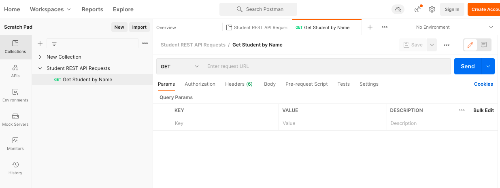

## Server-Side Programming & Node.js


# 2.5: REST & API Endpoints


- Learning Goals
- Introduction
- APIs, Web Services, and REST—Oh My!
- CRUD (Create, Read, Update, and Delete) and REST
- Designing a REST API
- Data Formats for HTTP Requests/Responses
- REST in Express
- Testing Your API with Postman
- Documenting Your API
- Spotlight on AI
- Summary
- Resources
- Task
- Forum


#### Learning Goals


- Discuss the key principles behind RESTful architecture and CRUD functionality
- Define and document endpoints for a complete REST API


#### Introduction

Ready to jump back into the world of server-side development? As you’ve likely picked up from the first couple of Exercises in this Achievement, server-side projects largely involve working with web servers—routing HTTP requests, logging requests, and serving static content, among many other server-related tasks. In the previous Exercise, you learned how to route HTTP requests for your API project using Express, a popular web server framework for JavaScript applications.

In this Exercise, you’ll be continuing in that same vein, only more in-depth—looking specifically at RESTful architecture and how you can create multiple routes for your REST API, myFlix, so you can allow clients to apply operations (creating, reading, updating, and deleting, i.e., CRUD) to files and data on your server. Sound like fun? Then, get ready to have a RESTful time!


#### APIs, Web Services, and REST—Oh My!

You were first introduced to APIs at the beginning of this course when you interacted with an external API to incorporate data into your JavaScript application. Then, at the beginning of this Achievement, you took a closer look at the structure of an application along with the components of an API that you will build for your Achievement 2 student project. To recap, an API (Application Programming Interface) is a set of communication protocols that allows one software system to plug into (receive information or use functionality from) another. APIs can exist for any kind of system—not just over the web. Microsoft, for example, offers a Windows API that allows desktop applications (even older ones) to run on its current operating system. Throughout this Achievement, however, you’ve been working specifically on an API for the web. This kind of API, an API that uses the World Wide Web to communicate, is called a web service.

In order to demonstrate the significance of web service APIs to server-side web development, let’s take another look at the role of the web server. A web server handles requests and responses from a client. Once a request to the server has been made, web servers can “expose,” or provide access to, two types of resources: files and data.


##### Files

The web was originally built for human-to-machine communication—web pages were exposed to human users to be viewed and interacted with via web browsers. As part of this system, a web server was used to process user requests from a browser and return responses accordingly, all for the primary purpose of delivering web pages formed of files (HTML files, CSS files, JavaScript files, JPG files, MP3 files, etc.). In fact, this was about all web servers were used for.


##### Data

Enter the web service. Now, web servers can expose more than just files—they can expose raw data, too, encapsulated in formats such as JSON and XML. This means that systems (clients) can now access resources (files and data) from other systems (the server) by sending requests to that server’s web service.

One of the most common patterns of architecture for web services/APIs is Representational State Transfer (REST). In a REST API, URLs, or endpoints, that are sent requests identify which resources on the web server the sender wants access to; the responses can then either return the resource itself or provide a message indicating what alteration was made to the resource.


> TIP!
> What is it that makes an API a REST API? A REST(ful) API adheres to the six principles of RESTful architecture. If you’d like to read about these principles, check out the documentation for REST Architectural Constraints.

Generally, REST employs HTTP (Hypertext Transfer Protocol), the most common protocol for data communication over the internet. Requests over HTTP contain an “HTTP request method” that indicates what operation is to be performed on the resource being requested. It’s the job of a REST API to read an HTTP request, apply the appropriate operation to the resource being requested, and send back an HTTP response that indicates whether it was successful.


###### Figure 1

Before moving on, let’s quickly summarize:


- An API is a set of communication protocols that allows one software system to receive information or use functionality from another system.
- A web service is a particular type of API—one that uses the web to communicate. The API you’re building throughout this Achievement is technically a web service.
- Web services allow servers to expose not only files, but data, as well.
- A REST API refers to an API (web service) that’s been built using RESTful architecture. REST APIs use endpoints to identify the resources on the web server the client wants to access.


#### CRUD (Create, Read, Update, and Delete) and REST

Now that you have an overview of what REST APIs do (i.e., handle requests for certain resources on a web server), let’s back up for a moment to take a look at CRUD. While CRUD sounds more like something a developer would say when they can’t get their API to work correctly, it’s actually an acronym. CRUD stands for “Create, Read, Update, and Delete.” These are the four basic functions of any system that stores data, which you may remember from Achievement 1. With CRUD, you can:


- Create new data
- Read existing data
- Update existing data
- Delete existing data

As with APIs, CRUD isn’t limited to the realm of the web. Most applications have some form of data storage—even, for example, Microsoft Word. Word is a native (rather than web) application through which you can “create” a new file, “read” the contents of an existing file, “update” an existing file, or “delete” an existing file. Any time a resource (file) is created, viewed, updated, or deleted, there will be some form of logic-storing and data-interaction going on behind-the-scenes.

When it comes to web applications, however, users (or other computer programs) aren’t interfacing directly with the data itself; rather, they’re interfacing with a web server that is, in turn, interacting with the data.


###### Figure 2

The REST API is what allows applications outside of your web application (i.e., “the client”) to send HTTP requests to your web server. The server then “translates” these requests to an appropriate CRUD manipulation of the server’s underlying data. As shown in the diagram, this data may not necessarily be stored on the web server itself—it could be stored in an external database or system. The only thing that matters is that the client doesn’t have direct access to it.

You use the four “methods” of HTTP request (`GET`, `PUT`, `POST`, and `DELETE`) to identify the type of CRUD operation the client is asking to make on the resource(s) it’s requesting.


```js
POST
```


```js
GET
```


```js
PUT
```


```js
PATCH
```


```js
DELETE
```


###### Figure 3

Note that this correlation is only what’s customary (as well as the common language you can understand). There’s not, in fact, anything inherent about the HTTP request method itself that will make the server apply its correlating CRUD operation. That’s the job of you, the developer. You need to write the appropriate REST API code to direct the HTTP request to the correct operation based on its method.

For example, in a REST API that stores information about products being sold by an online vendor, an HTTP request to the URL “mystorename.com/products” with the HTTP method of `POST` could be used to specify that you want to CREATE a new product in the online catalog for “mystorename,” which is stored on the server. An HTTP request to the URL “mystorename.com/products” with the HTTP method of `GET`, on the other hand, could be used to specify that you want to READ information about all the products sold by the store.

Similarly, you could use the HTTP request methods for `PUT` and `DELETE` to specify that you want to UPDATE and DELETE certain products stored in the catalog. It’s the job of your REST API to apply these CRUD operations appropriately to the data on the server based on the HTTP method type.

With all of this in mind, let’s take a deeper look at how you can design a REST API from the ground up.


#### Designing a REST API

You want your REST API to allow clients to access data directly from your web server. The first step to designing it, therefore, is to start defining exactly what data you want your server to expose. When doing so, you’ll need to consider the following key questions:


- What information could the client want to retrieve (or GET) from the server?
- What information could it want to add (or POST)?
- What information could your client want to update (PUT)?
- What information could your client want to remove (DELETE)?

As this is your first time building an API, coming up with answers for these questions on your own would probably be difficult, so let’s work through an example. Let’s say you wanted to design a REST API that allowed you to keep track of students at a school. First, you’d want to break down the different types of requests a client (the user of your API) might want to make:

GET:


- You want to be able to get a list of students: their IDs, names, current classes, and grades.
- You want to be able to get the GPA of a certain student.

POST:


- You want to be able to add a new student to the list of students.

PUT:


- You want to be able to update the grade of a certain student in a certain class.

DELETE:


- You want to be able to remove a student from the list using their student ID.

While these are just some of the possible requests a user might want to make via your API, it’s a good start. The next step would be to associate each of these operations with an endpoint. As you already know, an endpoint is the URL on your server at which the client can make a request to the server—and from which they receive a response accordingly. You also need to specify the HTTP method (`GET`, `POST`, `PUT`, or `DELETE`) associated with the request.


```js
GET
```


```js
GET
```


```js
POST
```


```js
DELETE
```


```js
PUT
```


```js
GET
```


###### Figure 4

You’ll want to note a few things here. First, the name for each URL endpoint is in line with the resource you’re trying to create/read/update/delete. As every request deals with student data, every URL endpoint begins with “students”; if, in the future, you were to create more allowable requests, for instance, for requesting and manipulating data about other aspects of the school (courses, faculty, campuses, etc.), you could structure additional URL endpoints accordingly (e.g., “/courses/…”).


> Note!
> When building a REST API, it’s best practice to use pluralized terms when endpoints are referring to a list of multiple resources. Even when retrieving a resource on a singular record, the endpoint should still contain the pluralized term. (For instance, in the table above, you’d still use the endpoint “/students/[ID]” when retrieving data for a single student.)
> 
> Think of this a bit like the folders on your hard drive. Your “Documents” folder likely contains more than one file, so you call it “Documents” (as opposed to simply “Document”). Even if you only needed one particular document from that folder, for instance, “Smith_Resume_2019.pdf,” it’s still the “Documents” folder, so when accessing it, you should use “Documents” → “Smith_CV_2019.pdf” rather than “Document” → “Smith_CV_2019.pdf.”

Second, two endpoints can have the same URL but be differentiated by their request method. For instance, the URL “/students” is used not only for a `GET` endpoint (which is used to get a list of all students), but also for a `POST` endpoint (which is used to add a new student). The server should take care of routing requests appropriately not just based on the URL they’re targeting, but also their HTTP request method.

You can use sub-URLS to specify attributes of a resource that you want to target with your request. In the example above, “/students/[ID]” has been specified as the endpoint when you want to get a particular student by their ID. The “[ID]” here is a placeholder for the actual ID that would be specified in the requesting URL. Including the [ID] sub-URL (“/students/[ID]”) allows you to request a particular student rather than retrieve the whole list of students (“/students”).

You can also add multiple sub-URLs to a master URL. For example, if you wanted to update a student’s grade in a particular class (as in the table above), you’d use “/students/[ID]/[Class]/[Grade]”. The “[ID]” and “[Class]” identifiers help you narrow down the specific student and class that you want to update the grade for, whereas “[Grade]” specifies the (new) grade you want to set.

Note that you should always design these endpoints under the assumption that you’ll then create a mechanism for the web server to store and manipulate the data you need for them. This is a “code-first” approach to development. You begin by envisioning what resources the clients of your application might want (such as student data), then you design the underlying data structures to store the resources from the server.

Conversely, when taking a “database-first” approach to development, first you’d design the database that stores certain data about certain entities (such as students), then you'd design endpoints that allow the users to access data from the database you’ve already designed.

Both of these are valid approaches to development, and which one you use will likely depend on the requirements of your project. For this course, however, you’ll start with the endpoints for your API in this Exercise, then design the database when you learn more about its development in the next Exercise.

Now that you’ve gone over REST API design at a high level, let’s talk a bit about the type of data that can be passed through HTTP requests and responses. After that, you’ll be ready to look at an actual implementation of a REST API using Express.


#### Data Formats for HTTP Requests/Responses

In this and previous Exercises, the HTTP request-response cycle has often been referred to as a method of accessing files and data from your web server; however, the actual format for these requests and responses has yet to be broached. Let’s take a step back for a moment and look at exactly how you can formulate your own HTTP requests and responses to use with your API:

Every HTTP request consists of:


- A request line containing the request method (POST, GET, PUT, and DELETE) and request URL. You should know these pretty well at this point.
- Request header fields (additional metadata associated with your request). You normally won’t have to worry about these as Express will compose them for you.
- An optional request body that can contain any additional information you want.

Every HTTP response consists of:


- A status line containing a status code that indicates whether the client’s request succeeded or failed (at a high level) and why. You’ll be looking more into this later on in this Exercise.
- Response header fields (additional metadata associated with your response). Just like with HTTP requests, Express will compose these for you.
- An optional response body that can contain any additional information you want.

Let’s start by taking a closer look at the request and response bodies (the third bullet in each list above); these are essentially blank slates that can be used to send along additional information in your requests and responses.

In the previous section, we provided a table of various requests (such as `GET`) you might make to an app for organizing student data along with their corresponding URL endpoints. Now, let’s take things one step further by visualizing what format you might want your API to expect for the “body” data in each request and response. Take a look at the table below, noting, in particular, the two “body data” columns that have been added on the right:


###### Figure 5


> Screen reader users can view a PDF of the table in Figure 5 here

In order to understand what’s going on in the two “body data” columns, let’s first go over request and response bodies and what they entail in more detail.


##### Request Body

A request body can be used to send along additional information about what the client is requesting. Most of the time, you won’t need one. This is because the URL often contains all the information you need. A `GET` request to the URL “/students”, for example, already provides all the necessary information about the resource you want to “get” (i.e., data about students). For this reason, the request body doesn’t need anything additional, and you can simply leave it empty.

A `POST` request to the URL “/students”, however, would require a request body as it needs additional data about what student to create. Therefore, you’d need to write your API in such a way as to expect JSON in the body of the request (which would represent data about the new student).

But what about the `PUT` request to the URL “/students/[Name]/[Class]/[Grade]”? In the table, it’s indicated that no request body is required, even though you’d be updating the grade of a certain student in a certain class. Why is this? Especially when the similar `POST` request above necessitated a request body?

What it comes down to is how much data you’re sending to the server. The `POST` request needs to send an entire JSON object with multiple pieces of data, such as the student’s name, their classes, and the grades in those classes. This data is too complex to include directly in the URL. With the `PUT` request, however, you’re only updating one piece of data: the grade. This makes it easy to include all the info you need directly within the URL. All you need to provide is the student ID and class, then finish up with the new grade you’d like to update.

As you’ve likely noticed already from looking at the table, the request body has been left empty for most of the request URLs. In the majority of cases, you simply won’t need to add any additional information past the URL itself.


##### Response Body

Moving on to the response body, you’ll notice every URL in the table has at least something included, setting it apart from the request body. This is because, no matter what, the server needs to send some kind of response back to the client, whether it’s simply telling the client the request was successful or returning some form of data.

In the case of `GET` requests, the content of the response body should be fairly obvious—the actual data that’s been requested. If you take another look at the table above, you can see that any `GET` request made at the “/students” URL will return a JSON object containing data about all of the students.

In general, response bodies can contain JSON (such as in the case of the `POST` request above, which sends back the student object that was just added to the array on the server) or simple text-based messages that describe the transaction that just occurred (such as in the case of the `PUT` request above); however, there aren’t any hard-fast rules for which you should use for what URL endpoints. You can visit the documentation page for [HTTP request methods](https://developer.mozilla.org/en-US/docs/Web/HTTP/Methods) and [HTTP response status code](https://developer.mozilla.org/en-US/docs/Web/HTTP/Status) for an in-depth look at each method.

As you design your myFlix REST API, it’s up to you to determine what makes the most sense for each URL. It’s also key that you document your API well, as this ensures that developers of the client application will know what data they need to send along with their requests, as well as what kind of data they can expect back in response.

Now that you have a better idea as to how you can go about designing your own REST API, let’s shift gears to the actual code, looking at how you can begin to piece one together using Express.


> You have learned a lot in this Exercise already. It’s time for a short tea break or a short walk before moving to the next section on REST in Express


#### REST in Express

In the previous Exercise, you learned how you can use Express to simplify HTTP request routing with the following syntax:


```js
app.METHOD(PATH, HANDLER)
```

This syntax allows you to route requests according to the URL endpoint and request type (method), for instance:


- app.get('/students', [handler]);: will handle a request to the URL endpoint “/students” with the HTTP request method GET
- app.post('/students', [handler]);: will handle a request to the URL endpoint “/students” with the HTTP request method POST

In order to build your full-fledged REST API, you’ll need to utilize these types of requests and more, with “more” here being a few new pieces of Express/Node.js functionality you’ll be learning below, from request parameters and response status codes to add-ons such as the `body-parser` and `uuid` modules.

Let’s start with some example code. In order to test the code out for yourself, you’ll need to create a new folder and, within this folder, create a new “test.js” file with the code included below (entirely separate from your Achievement project folder). Next, execute the file in BASH (`node test.js`). For the code to work correctly, you’ll need to make sure you’ve installed all the necessary dependencies. These include Express, Body-parser, and Uuid.

To get your code up and running so you’ll be able to test it later, you can follow along with the steps and video walkthrough below:

Click for sound
  @keyframes VOLUME_SMALL_WAVE_FLASH {
    0% { opacity: 0; }
    33% { opacity: 1; }
    66% { opacity: 1; }
    100% { opacity: 0; }
  }

  @keyframes VOLUME_LARGE_WAVE_FLASH {
    0% { opacity: 0; }
    33% { opacity: 1; }
    66% { opacity: 1; }
    100% { opacity: 0; }
  }

  .volume__small-wave {
    animation: VOLUME_SMALL_WAVE_FLASH 2s infinite;
    opacity: 0;
  }

  .volume__large-wave {
    animation: VOLUME_LARGE_WAVE_FLASH 2s infinite .3s;
    opacity: 0;
  }
9:32
        @media (prefers-reduced-motion: no-preference) {
          @keyframes w-control-bar-fade-in {
            0% {
              opacity: 0;
              transform: translateX(50%) translateY(10px);
            }
            100% {
              opacity: 1;
              transform: translateX(50%) translateY(0px);
            }
          }
        }
      
      #wistia_chrome_37 #wistia_grid_81_wrapper .w-css-reset{font-size:14px;}
#wistia_chrome_37 #wistia_grid_81_wrapper div.w-css-reset{box-sizing:inherit;box-shadow:none;color:inherit;display:block;float:none;font:inherit;font-family:inherit;font-style:normal;font-weight:normal;font-size:inherit;letter-spacing:0;line-height:inherit;margin:0;max-height:none;max-width:none;min-height:0;min-width:0;padding:0;position:static;text-decoration:none;text-transform:none;text-shadow:none;transition:none;word-wrap:normal;-webkit-tap-highlight-color:rgba(0,0,0,0);-webkit-user-select:none;-webkit-font-smoothing:antialiased}
#wistia_chrome_37 #wistia_grid_81_wrapper span.w-css-reset{box-sizing:inherit;box-shadow:none;color:inherit;display:block;float:none;font:inherit;font-family:inherit;font-style:normal;font-weight:normal;font-size:inherit;letter-spacing:0;line-height:inherit;margin:0;max-height:none;max-width:none;min-height:0;min-width:0;padding:0;position:static;text-decoration:none;text-transform:none;text-shadow:none;transition:none;word-wrap:normal;-webkit-tap-highlight-color:rgba(0,0,0,0);-webkit-user-select:none;-webkit-font-smoothing:antialiased}
#wistia_chrome_37 #wistia_grid_81_wrapper ul.w-css-reset{box-sizing:inherit;box-shadow:none;color:inherit;display:block;float:none;font:inherit;font-family:inherit;font-style:normal;font-weight:normal;font-size:inherit;letter-spacing:0;line-height:inherit;margin:0;max-height:none;max-width:none;min-height:0;min-width:0;padding:0;position:static;text-decoration:none;text-transform:none;text-shadow:none;transition:none;word-wrap:normal;-webkit-tap-highlight-color:rgba(0,0,0,0);-webkit-user-select:none;-webkit-font-smoothing:antialiased}
#wistia_chrome_37 #wistia_grid_81_wrapper li.w-css-reset{box-sizing:inherit;box-shadow:none;color:inherit;display:block;float:none;font:inherit;font-family:inherit;font-style:normal;font-weight:normal;font-size:inherit;letter-spacing:0;line-height:inherit;margin:0;max-height:none;max-width:none;min-height:0;min-width:0;padding:0;position:static;text-decoration:none;text-transform:none;text-shadow:none;transition:none;word-wrap:normal;-webkit-tap-highlight-color:rgba(0,0,0,0);-webkit-user-select:none;-webkit-font-smoothing:antialiased}
#wistia_chrome_37 #wistia_grid_81_wrapper label.w-css-reset{box-sizing:inherit;box-shadow:none;color:inherit;display:block;float:none;font:inherit;font-family:inherit;font-style:normal;font-weight:normal;font-size:inherit;letter-spacing:0;line-height:inherit;margin:0;max-height:none;max-width:none;min-height:0;min-width:0;padding:0;position:static;text-decoration:none;text-transform:none;text-shadow:none;transition:none;word-wrap:normal;-webkit-tap-highlight-color:rgba(0,0,0,0);-webkit-user-select:none;-webkit-font-smoothing:antialiased}
#wistia_chrome_37 #wistia_grid_81_wrapper fieldset.w-css-reset{box-sizing:inherit;box-shadow:none;color:inherit;display:block;float:none;font:inherit;font-family:inherit;font-style:normal;font-weight:normal;font-size:inherit;letter-spacing:0;line-height:inherit;margin:0;max-height:none;max-width:none;min-height:0;min-width:0;padding:0;position:static;text-decoration:none;text-transform:none;text-shadow:none;transition:none;word-wrap:normal;-webkit-tap-highlight-color:rgba(0,0,0,0);-webkit-user-select:none;-webkit-font-smoothing:antialiased}
#wistia_chrome_37 #wistia_grid_81_wrapper button.w-css-reset{box-sizing:inherit;box-shadow:none;color:inherit;display:block;float:none;font:inherit;font-family:inherit;font-style:normal;font-weight:normal;font-size:inherit;letter-spacing:0;line-height:inherit;margin:0;max-height:none;max-width:none;min-height:0;min-width:0;padding:0;position:static;text-decoration:none;text-transform:none;text-shadow:none;transition:none;word-wrap:normal;-webkit-tap-highlight-color:rgba(0,0,0,0);-webkit-user-select:none;-webkit-font-smoothing:antialiased}
#wistia_chrome_37 #wistia_grid_81_wrapper img.w-css-reset{box-sizing:inherit;box-shadow:none;color:inherit;display:block;float:none;font:inherit;font-family:inherit;font-style:normal;font-weight:normal;font-size:inherit;letter-spacing:0;line-height:inherit;margin:0;max-height:none;max-width:none;min-height:0;min-width:0;padding:0;position:static;text-decoration:none;text-transform:none;text-shadow:none;transition:none;word-wrap:normal;-webkit-tap-highlight-color:rgba(0,0,0,0);-webkit-user-select:none;-webkit-font-smoothing:antialiased}
#wistia_chrome_37 #wistia_grid_81_wrapper a.w-css-reset{box-sizing:inherit;box-shadow:none;color:inherit;display:block;float:none;font:inherit;font-family:inherit;font-style:normal;font-weight:normal;font-size:inherit;letter-spacing:0;line-height:inherit;margin:0;max-height:none;max-width:none;min-height:0;min-width:0;padding:0;position:static;text-decoration:none;text-transform:none;text-shadow:none;transition:none;word-wrap:normal;-webkit-tap-highlight-color:rgba(0,0,0,0);-webkit-user-select:none;-webkit-font-smoothing:antialiased}
#wistia_chrome_37 #wistia_grid_81_wrapper svg.w-css-reset{box-sizing:inherit;box-shadow:none;color:inherit;display:block;float:none;font:inherit;font-family:inherit;font-style:normal;font-weight:normal;font-size:inherit;letter-spacing:0;line-height:inherit;margin:0;max-height:none;max-width:none;min-height:0;min-width:0;padding:0;position:static;text-decoration:none;text-transform:none;text-shadow:none;transition:none;word-wrap:normal;-webkit-tap-highlight-color:rgba(0,0,0,0);-webkit-user-select:none;-webkit-font-smoothing:antialiased}
#wistia_chrome_37 #wistia_grid_81_wrapper p.w-css-reset{box-sizing:inherit;box-shadow:none;color:inherit;display:block;float:none;font:inherit;font-family:inherit;font-style:normal;font-weight:normal;font-size:inherit;letter-spacing:0;line-height:inherit;margin:0;max-height:none;max-width:none;min-height:0;min-width:0;padding:0;position:static;text-decoration:none;text-transform:none;text-shadow:none;transition:none;word-wrap:normal;-webkit-tap-highlight-color:rgba(0,0,0,0);-webkit-user-select:none;-webkit-font-smoothing:antialiased}
#wistia_chrome_37 #wistia_grid_81_wrapper a.w-css-reset{border:0;}
#wistia_chrome_37 #wistia_grid_81_wrapper h1.w-css-reset{box-sizing:inherit;box-shadow:none;color:inherit;display:block;float:none;font:inherit;font-family:inherit;font-style:normal;font-weight:normal;font-size:2em;letter-spacing:0;line-height:inherit;margin:0;max-height:none;max-width:none;min-height:0;min-width:0;padding:0;position:static;text-decoration:none;text-transform:none;text-shadow:none;transition:none;word-wrap:normal;-webkit-tap-highlight-color:rgba(0,0,0,0);-webkit-user-select:none;-webkit-font-smoothing:antialiased}
#wistia_chrome_37 #wistia_grid_81_wrapper h2.w-css-reset{box-sizing:inherit;box-shadow:none;color:inherit;display:block;float:none;font:inherit;font-family:inherit;font-style:normal;font-weight:normal;font-size:1.5em;letter-spacing:0;line-height:inherit;margin:0;max-height:none;max-width:none;min-height:0;min-width:0;padding:0;position:static;text-decoration:none;text-transform:none;text-shadow:none;transition:none;word-wrap:normal;-webkit-tap-highlight-color:rgba(0,0,0,0);-webkit-user-select:none;-webkit-font-smoothing:antialiased}
#wistia_chrome_37 #wistia_grid_81_wrapper h3.w-css-reset{box-sizing:inherit;box-shadow:none;color:inherit;display:block;float:none;font:inherit;font-family:inherit;font-style:normal;font-weight:normal;font-size:1.17em;letter-spacing:0;line-height:inherit;margin:0;max-height:none;max-width:none;min-height:0;min-width:0;padding:0;position:static;text-decoration:none;text-transform:none;text-shadow:none;transition:none;word-wrap:normal;-webkit-tap-highlight-color:rgba(0,0,0,0);-webkit-user-select:none;-webkit-font-smoothing:antialiased}
#wistia_chrome_37 #wistia_grid_81_wrapper p.w-css-reset{margin:1.4em 0;}
#wistia_chrome_37 #wistia_grid_81_wrapper a.w-css-reset{display:inline;}
#wistia_chrome_37 #wistia_grid_81_wrapper span.w-css-reset{display:inline;}
#wistia_chrome_37 #wistia_grid_81_wrapper svg.w-css-reset{display:inline;}
#wistia_chrome_37 #wistia_grid_81_wrapper ul.w-css-reset{box-sizing:inherit;box-shadow:none;color:inherit;display:block;float:none;font:inherit;font-family:inherit;font-style:normal;font-weight:normal;font-size:inherit;letter-spacing:0;line-height:inherit;margin:0;max-height:none;max-width:none;min-height:0;min-width:0;padding:0;position:static;text-decoration:none;text-transform:none;text-shadow:none;transition:none;word-wrap:normal;-webkit-tap-highlight-color:rgba(0,0,0,0);-webkit-user-select:none;-webkit-font-smoothing:antialiased;list-style-type:none}
#wistia_chrome_37 #wistia_grid_81_wrapper ol.w-css-reset{box-sizing:inherit;box-shadow:none;color:inherit;display:block;float:none;font:inherit;font-family:inherit;font-style:normal;font-weight:normal;font-size:inherit;letter-spacing:0;line-height:inherit;margin:0;max-height:none;max-width:none;min-height:0;min-width:0;padding:0;position:static;text-decoration:none;text-transform:none;text-shadow:none;transition:none;word-wrap:normal;-webkit-tap-highlight-color:rgba(0,0,0,0);-webkit-user-select:none;-webkit-font-smoothing:antialiased;list-style-type:none}
#wistia_chrome_37 #wistia_grid_81_wrapper li.w-css-reset{box-sizing:inherit;box-shadow:none;color:inherit;display:block;float:none;font:inherit;font-family:inherit;font-style:normal;font-weight:normal;font-size:inherit;letter-spacing:0;line-height:inherit;margin:0;max-height:none;max-width:none;min-height:0;min-width:0;padding:0;position:static;text-decoration:none;text-transform:none;text-shadow:none;transition:none;word-wrap:normal;-webkit-tap-highlight-color:rgba(0,0,0,0);-webkit-user-select:none;-webkit-font-smoothing:antialiased;list-style-type:none}
#wistia_chrome_37 #wistia_grid_81_wrapper ul:before.w-css-reset{display:none}
#wistia_chrome_37 #wistia_grid_81_wrapper ol:before.w-css-reset{display:none}
#wistia_chrome_37 #wistia_grid_81_wrapper li:before.w-css-reset{display:none}
#wistia_chrome_37 #wistia_grid_81_wrapper ul:after.w-css-reset{display:none}
#wistia_chrome_37 #wistia_grid_81_wrapper ol:after.w-css-reset{display:none}
#wistia_chrome_37 #wistia_grid_81_wrapper li:after.w-css-reset{display:none}
#wistia_chrome_37 #wistia_grid_81_wrapper label.w-css-reset{background-attachment:scroll;background-color:transparent;background-image:none;background-position:0 0;background-repeat:no-repeat;background-size:100% 100%;float:none;outline:none}
#wistia_chrome_37 #wistia_grid_81_wrapper button.w-css-reset{background-attachment:scroll;background-color:transparent;background-image:none;background-position:0 0;background-repeat:no-repeat;background-size:100% 100%;border:0;border-radius:0;outline:none;position:static}
#wistia_chrome_37 #wistia_grid_81_wrapper img.w-css-reset{border:0;display:inline-block;vertical-align:top;border-radius:0;outline:none;position:static}
#wistia_chrome_37 #wistia_grid_81_wrapper .w-css-reset button::-moz-focus-inner{border: 0;}
      #wistia_chrome_37 #wistia_grid_81_wrapper .w-css-reset-tree {font-size:14px;}
#wistia_chrome_37 #wistia_grid_81_wrapper .w-css-reset-tree div{box-sizing:inherit;box-shadow:none;color:inherit;display:block;float:none;font:inherit;font-family:inherit;font-style:normal;font-weight:normal;font-size:inherit;letter-spacing:0;line-height:inherit;margin:0;max-height:none;max-width:none;min-height:0;min-width:0;padding:0;position:static;text-decoration:none;text-transform:none;text-shadow:none;transition:none;word-wrap:normal;-webkit-tap-highlight-color:rgba(0,0,0,0);-webkit-user-select:none;-webkit-font-smoothing:antialiased}
#wistia_chrome_37 #wistia_grid_81_wrapper .w-css-reset-tree span{box-sizing:inherit;box-shadow:none;color:inherit;display:block;float:none;font:inherit;font-family:inherit;font-style:normal;font-weight:normal;font-size:inherit;letter-spacing:0;line-height:inherit;margin:0;max-height:none;max-width:none;min-height:0;min-width:0;padding:0;position:static;text-decoration:none;text-transform:none;text-shadow:none;transition:none;word-wrap:normal;-webkit-tap-highlight-color:rgba(0,0,0,0);-webkit-user-select:none;-webkit-font-smoothing:antialiased}
#wistia_chrome_37 #wistia_grid_81_wrapper .w-css-reset-tree ul{box-sizing:inherit;box-shadow:none;color:inherit;display:block;float:none;font:inherit;font-family:inherit;font-style:normal;font-weight:normal;font-size:inherit;letter-spacing:0;line-height:inherit;margin:0;max-height:none;max-width:none;min-height:0;min-width:0;padding:0;position:static;text-decoration:none;text-transform:none;text-shadow:none;transition:none;word-wrap:normal;-webkit-tap-highlight-color:rgba(0,0,0,0);-webkit-user-select:none;-webkit-font-smoothing:antialiased}
#wistia_chrome_37 #wistia_grid_81_wrapper .w-css-reset-tree li{box-sizing:inherit;box-shadow:none;color:inherit;display:block;float:none;font:inherit;font-family:inherit;font-style:normal;font-weight:normal;font-size:inherit;letter-spacing:0;line-height:inherit;margin:0;max-height:none;max-width:none;min-height:0;min-width:0;padding:0;position:static;text-decoration:none;text-transform:none;text-shadow:none;transition:none;word-wrap:normal;-webkit-tap-highlight-color:rgba(0,0,0,0);-webkit-user-select:none;-webkit-font-smoothing:antialiased}
#wistia_chrome_37 #wistia_grid_81_wrapper .w-css-reset-tree label{box-sizing:inherit;box-shadow:none;color:inherit;display:block;float:none;font:inherit;font-family:inherit;font-style:normal;font-weight:normal;font-size:inherit;letter-spacing:0;line-height:inherit;margin:0;max-height:none;max-width:none;min-height:0;min-width:0;padding:0;position:static;text-decoration:none;text-transform:none;text-shadow:none;transition:none;word-wrap:normal;-webkit-tap-highlight-color:rgba(0,0,0,0);-webkit-user-select:none;-webkit-font-smoothing:antialiased}
#wistia_chrome_37 #wistia_grid_81_wrapper .w-css-reset-tree fieldset{box-sizing:inherit;box-shadow:none;color:inherit;display:block;float:none;font:inherit;font-family:inherit;font-style:normal;font-weight:normal;font-size:inherit;letter-spacing:0;line-height:inherit;margin:0;max-height:none;max-width:none;min-height:0;min-width:0;padding:0;position:static;text-decoration:none;text-transform:none;text-shadow:none;transition:none;word-wrap:normal;-webkit-tap-highlight-color:rgba(0,0,0,0);-webkit-user-select:none;-webkit-font-smoothing:antialiased}
#wistia_chrome_37 #wistia_grid_81_wrapper .w-css-reset-tree button{box-sizing:inherit;box-shadow:none;color:inherit;display:block;float:none;font:inherit;font-family:inherit;font-style:normal;font-weight:normal;font-size:inherit;letter-spacing:0;line-height:inherit;margin:0;max-height:none;max-width:none;min-height:0;min-width:0;padding:0;position:static;text-decoration:none;text-transform:none;text-shadow:none;transition:none;word-wrap:normal;-webkit-tap-highlight-color:rgba(0,0,0,0);-webkit-user-select:none;-webkit-font-smoothing:antialiased}
#wistia_chrome_37 #wistia_grid_81_wrapper .w-css-reset-tree img{box-sizing:inherit;box-shadow:none;color:inherit;display:block;float:none;font:inherit;font-family:inherit;font-style:normal;font-weight:normal;font-size:inherit;letter-spacing:0;line-height:inherit;margin:0;max-height:none;max-width:none;min-height:0;min-width:0;padding:0;position:static;text-decoration:none;text-transform:none;text-shadow:none;transition:none;word-wrap:normal;-webkit-tap-highlight-color:rgba(0,0,0,0);-webkit-user-select:none;-webkit-font-smoothing:antialiased}
#wistia_chrome_37 #wistia_grid_81_wrapper .w-css-reset-tree a{box-sizing:inherit;box-shadow:none;color:inherit;display:block;float:none;font:inherit;font-family:inherit;font-style:normal;font-weight:normal;font-size:inherit;letter-spacing:0;line-height:inherit;margin:0;max-height:none;max-width:none;min-height:0;min-width:0;padding:0;position:static;text-decoration:none;text-transform:none;text-shadow:none;transition:none;word-wrap:normal;-webkit-tap-highlight-color:rgba(0,0,0,0);-webkit-user-select:none;-webkit-font-smoothing:antialiased}
#wistia_chrome_37 #wistia_grid_81_wrapper .w-css-reset-tree svg{box-sizing:inherit;box-shadow:none;color:inherit;display:block;float:none;font:inherit;font-family:inherit;font-style:normal;font-weight:normal;font-size:inherit;letter-spacing:0;line-height:inherit;margin:0;max-height:none;max-width:none;min-height:0;min-width:0;padding:0;position:static;text-decoration:none;text-transform:none;text-shadow:none;transition:none;word-wrap:normal;-webkit-tap-highlight-color:rgba(0,0,0,0);-webkit-user-select:none;-webkit-font-smoothing:antialiased}
#wistia_chrome_37 #wistia_grid_81_wrapper .w-css-reset-tree p{box-sizing:inherit;box-shadow:none;color:inherit;display:block;float:none;font:inherit;font-family:inherit;font-style:normal;font-weight:normal;font-size:inherit;letter-spacing:0;line-height:inherit;margin:0;max-height:none;max-width:none;min-height:0;min-width:0;padding:0;position:static;text-decoration:none;text-transform:none;text-shadow:none;transition:none;word-wrap:normal;-webkit-tap-highlight-color:rgba(0,0,0,0);-webkit-user-select:none;-webkit-font-smoothing:antialiased}
#wistia_chrome_37 #wistia_grid_81_wrapper .w-css-reset-tree a{border:0;}
#wistia_chrome_37 #wistia_grid_81_wrapper .w-css-reset-tree h1{box-sizing:inherit;box-shadow:none;color:inherit;display:block;float:none;font:inherit;font-family:inherit;font-style:normal;font-weight:normal;font-size:2em;letter-spacing:0;line-height:inherit;margin:0;max-height:none;max-width:none;min-height:0;min-width:0;padding:0;position:static;text-decoration:none;text-transform:none;text-shadow:none;transition:none;word-wrap:normal;-webkit-tap-highlight-color:rgba(0,0,0,0);-webkit-user-select:none;-webkit-font-smoothing:antialiased}
#wistia_chrome_37 #wistia_grid_81_wrapper .w-css-reset-tree h2{box-sizing:inherit;box-shadow:none;color:inherit;display:block;float:none;font:inherit;font-family:inherit;font-style:normal;font-weight:normal;font-size:1.5em;letter-spacing:0;line-height:inherit;margin:0;max-height:none;max-width:none;min-height:0;min-width:0;padding:0;position:static;text-decoration:none;text-transform:none;text-shadow:none;transition:none;word-wrap:normal;-webkit-tap-highlight-color:rgba(0,0,0,0);-webkit-user-select:none;-webkit-font-smoothing:antialiased}
#wistia_chrome_37 #wistia_grid_81_wrapper .w-css-reset-tree h3{box-sizing:inherit;box-shadow:none;color:inherit;display:block;float:none;font:inherit;font-family:inherit;font-style:normal;font-weight:normal;font-size:1.17em;letter-spacing:0;line-height:inherit;margin:0;max-height:none;max-width:none;min-height:0;min-width:0;padding:0;position:static;text-decoration:none;text-transform:none;text-shadow:none;transition:none;word-wrap:normal;-webkit-tap-highlight-color:rgba(0,0,0,0);-webkit-user-select:none;-webkit-font-smoothing:antialiased}
#wistia_chrome_37 #wistia_grid_81_wrapper .w-css-reset-tree p{margin:1.4em 0;}
#wistia_chrome_37 #wistia_grid_81_wrapper .w-css-reset-tree a{display:inline;}
#wistia_chrome_37 #wistia_grid_81_wrapper .w-css-reset-tree span{display:inline;}
#wistia_chrome_37 #wistia_grid_81_wrapper .w-css-reset-tree svg{display:inline;}
#wistia_chrome_37 #wistia_grid_81_wrapper .w-css-reset-tree ul{box-sizing:inherit;box-shadow:none;color:inherit;display:block;float:none;font:inherit;font-family:inherit;font-style:normal;font-weight:normal;font-size:inherit;letter-spacing:0;line-height:inherit;margin:0;max-height:none;max-width:none;min-height:0;min-width:0;padding:0;position:static;text-decoration:none;text-transform:none;text-shadow:none;transition:none;word-wrap:normal;-webkit-tap-highlight-color:rgba(0,0,0,0);-webkit-user-select:none;-webkit-font-smoothing:antialiased;list-style-type:none}
#wistia_chrome_37 #wistia_grid_81_wrapper .w-css-reset-tree ol{box-sizing:inherit;box-shadow:none;color:inherit;display:block;float:none;font:inherit;font-family:inherit;font-style:normal;font-weight:normal;font-size:inherit;letter-spacing:0;line-height:inherit;margin:0;max-height:none;max-width:none;min-height:0;min-width:0;padding:0;position:static;text-decoration:none;text-transform:none;text-shadow:none;transition:none;word-wrap:normal;-webkit-tap-highlight-color:rgba(0,0,0,0);-webkit-user-select:none;-webkit-font-smoothing:antialiased;list-style-type:none}
#wistia_chrome_37 #wistia_grid_81_wrapper .w-css-reset-tree li{box-sizing:inherit;box-shadow:none;color:inherit;display:block;float:none;font:inherit;font-family:inherit;font-style:normal;font-weight:normal;font-size:inherit;letter-spacing:0;line-height:inherit;margin:0;max-height:none;max-width:none;min-height:0;min-width:0;padding:0;position:static;text-decoration:none;text-transform:none;text-shadow:none;transition:none;word-wrap:normal;-webkit-tap-highlight-color:rgba(0,0,0,0);-webkit-user-select:none;-webkit-font-smoothing:antialiased;list-style-type:none}
#wistia_chrome_37 #wistia_grid_81_wrapper .w-css-reset-tree ul:before{display:none}
#wistia_chrome_37 #wistia_grid_81_wrapper .w-css-reset-tree ol:before{display:none}
#wistia_chrome_37 #wistia_grid_81_wrapper .w-css-reset-tree li:before{display:none}
#wistia_chrome_37 #wistia_grid_81_wrapper .w-css-reset-tree ul:after{display:none}
#wistia_chrome_37 #wistia_grid_81_wrapper .w-css-reset-tree ol:after{display:none}
#wistia_chrome_37 #wistia_grid_81_wrapper .w-css-reset-tree li:after{display:none}
#wistia_chrome_37 #wistia_grid_81_wrapper .w-css-reset-tree label{background-attachment:scroll;background-color:transparent;background-image:none;background-position:0 0;background-repeat:no-repeat;background-size:100% 100%;float:none;outline:none}
#wistia_chrome_37 #wistia_grid_81_wrapper .w-css-reset-tree button{background-attachment:scroll;background-color:transparent;background-image:none;background-position:0 0;background-repeat:no-repeat;background-size:100% 100%;border:0;border-radius:0;outline:none;position:static}
#wistia_chrome_37 #wistia_grid_81_wrapper .w-css-reset-tree img{border:0;display:inline-block;vertical-align:top;border-radius:0;outline:none;position:static}
#wistia_chrome_37 #wistia_grid_81_wrapper .w-css-reset-tree  button::-moz-focus-inner{border: 0;}
      #wistia_chrome_37 #wistia_grid_81_wrapper .w-css-reset-max-width-none-important{max-width:none!important}
      #wistia_chrome_37 #wistia_grid_81_wrapper .w-css-reset-button-important{border-radius:0!important;color:#fff!important;}
    #wistia_grid_81_wrapper{-moz-box-sizing:content-box;-webkit-box-sizing:content-box;box-sizing:content-box;font-family:Arial,sans-serif;font-size:14px;height:100%;position:relative;text-align:left;width:100%;}
#wistia_grid_81_wrapper *{-moz-box-sizing:content-box;-webkit-box-sizing:content-box;box-sizing:content-box;}
#wistia_grid_81_above{position:relative;}
#wistia_grid_81_main{display:block;height:100%;position:relative;}
#wistia_grid_81_behind{height:100%;left:0;position:absolute;top:0;width:100%;}
#wistia_grid_81_center{height:100%;overflow:hidden;position:relative;width:100%;}
#wistia_grid_81_front{display:none;height:100%;left:0;position:absolute;top:0;width:100%;}
#wistia_grid_81_top_inside{position:absolute;left:0;top:0;width:100%;}
#wistia_grid_81_top{width:100%;position:absolute;bottom:0;left:0;}
#wistia_grid_81_bottom_inside{position:absolute;left:0;bottom:0;width:100%;}
#wistia_grid_81_bottom{width:100%;position:absolute;top:0;left:0;}
#wistia_grid_81_left_inside{height:100%;position:absolute;left:0;top:0;}
#wistia_grid_81_left{height:100%;position:absolute;right:0;top:0;}
#wistia_grid_81_right_inside{height:100%;right:0;position:absolute;top:0;}
#wistia_grid_81_right{height:100%;left:0;position:absolute;top:0;}
#wistia_grid_81_below{position:relative;}


- In BASH, run the code npm init -y (this generates an empty npm project npm init without asking you any questions -y).
- Also in BASH, run the code npm install --save express uuid body-parser (this installs Express, Body-parser, and Uuid npm install and automatically adds them to the “dependencies” section of your “package.json” file --save). You previously installed Express in the folder for your Achievement project; however, as this will be a brand-new folder solely for the purpose of testing the code below, you’ll need to install it again. Remember—when you install a package, you’re only installing it in the current folder, not to your computer itself. Each time you want to use a package in a new project, you’ll need to install it as a dependency of that particular project.
- Write out the entire block of code below in a new file called “test.js”.
- In BASH, run the code node test.js (this executes your “test.js” file and, subsequently, the code).


> Don’t let the sight of all that code below scare you! You’ll be walking through each section of it slowly and thoroughly throughout the rest of the Exercise. By the time you get to the end, you’ll understand what each part means.


```js
const express = require('express'),
  bodyParser = require('body-parser'),
  uuid = require('uuid');

const app = express();

app.use(bodyParser.json());

let students = [
  {
    id: 1,
    name: 'Jessica Drake',
    classes: {
      biology: 95,
      algebra: 92
    }
  },
  {
    id: 2,
    name: 'Ben Cohen',
    classes: {
      biology: 95,
      algebra: 92
    }
  },
  {
    id: 3,
    name: 'Lisa Downing',
    classes: {
      biology: 95,
      algebra: 92
    }
  }
];

// Gets the list of data about ALL students

app.get('/students', (req, res) => {
  res.json(students);
});
// Gets the data about a single student, by name

app.get('/students/:name', (req, res) => {
  res.json(students.find((student) =>
    { return student.name === req.params.name }));
});

// Adds data for a new student to our list of students.
app.post('/students', (req, res) => {
  let newStudent = req.body;

  if (!newStudent.name) {
    const message = 'Missing name in request body';
    res.status(400).send(message);
  } else {
    newStudent.id = uuid.v4();
    students.push(newStudent);
    res.status(201).send(newStudent);
  }
});

// Deletes a student from our list by ID
app.delete('/students/:id', (req, res) => {
  let student = students.find((student) => { return student.id === req.params.id });

  if (student) {
    students = students.filter((obj) => { return obj.id !== req.params.id });
    res.status(201).send('Student ' + req.params.id + ' was deleted.');
  }
});

// Update the "grade" of a student by student name/class name
app.put('/students/:name/:class/:grade', (req, res) => {
  let student = students.find((student) => { return student.name === req.params.name });

  if (student) {
    student.classes[req.params.class] = parseInt(req.params.grade);
    res.status(201).send('Student ' + req.params.name + ' was assigned a grade of ' + req.params.grade + ' in ' + req.params.class);
  } else {
    res.status(404).send('Student with the name ' + req.params.name + ' was not found.');
  }
});

// Gets the GPA of a student
app.get('/students/:name/gpa', (req, res) => {
  let student = students.find((student) => { return student.name === req.params.name });

  if (student) {
    let classesGrades = Object.values(student.classes); // Object.values() filters out object's keys and keeps the values that are returned as a new array
    let sumOfGrades = 0;
    classesGrades.forEach(grade => {
      sumOfGrades = sumOfGrades + grade;
    });

    let gpa = sumOfGrades / classesGrades.length;
    console.log(sumOfGrades);
    console.log(classesGrades.length);
    console.log(gpa);
    res.status(201).send('' + gpa);
    //res.status(201).send(gpa);
  } else {
    res.status(404).send('Student with the name ' + req.params.name + ' was not found.');
  }
});

app.listen(8080, () => {
  console.log('Your app is listening on port 8080');
});
```

The first thing to note regarding the code above is that student data is being stored “in-memory.” This means that it’s stored on the server rather than in an external database—in fact, it’s defined right there at the top of the code, stored in an array of objects called `students`. (If you were linking to an external database, you would see a link to the database, instead. You’ll learn how to connect your API to an external database in more detail in Exercise 2.8: The Business Logic Layer) The three students currently in the database are Jessica Drake, Ben Cohen, and Lisa Downing.

One of the consequences of storing data in-memory is that the data will be tied to one running instance of the application. If you were to stop or restart the application, the data would be reset. In the next Exercise, you’ll learn about external databases, which allow you to persist (save) data between running instances of an application. Generally, it makes more sense to store your data like this (especially for larger apps); however, for testing and illustrative purposes, in-memory is sufficient.

While the code above may look rather complicated at first, all it really is is a long list of request-response functions. (Remember that every possible request a user will be able to make needs to be given its own request-response function.) Each function routes a request to a callback function, which either 1) sends back data from the `students` array as a response, or 2) modifies the array data stored on the server based on the request (and also sends back a response detailing what was modified).

Let’s start by looking at one of the functions in more detail—the `GET` request to the “/students” URL endpoint. It’s a good idea to think first about what this request is doing (requesting a list of students from the server) before looking at the code.


```js
app.get('/students', (req, res) => {
  res.json(students);
});
```

The first line of code routes the request to the server, while the second line of code defines the format of the response that the server will send back. Think back to the table with all the request and response body data from above. For all `GET` requests to the “/students” URL endpoint, it specified that the server should return “a JSON object holding data about all the students”:


```js
GET
```


###### Figure 6

Thus, the code `res.json(students);` has been included to return the `students` array to the client, formatted as JSON using Express’s “.json” functionality.

Let’s take a look at another request for the “/students” endpoint, this time, for the `POST` request that adds a student to your list of students:


```js
app.post('/students', (req, res) => {
  let newStudent = req.body;

  if (!newStudent.name) {
    const message = 'Missing "name" in request body';
    res.status(400).send(message);
  } else {
    newStudent.id = uuid.v4();
    students.push(newStudent);
    res.status(201).send(newStudent);
  }
});
```

This time, the code is routed for `POST` requests. The code takes data from the request (in this case, data about a new student) and adds it as a new element to the array already on the server (`students.push(newStudent);`). (If this application connected to an external database rather than storing the data in-memory, you’d be adding the element to that database instead.)

You’ll also see that the request is still paired with a response, which, in this case, is the object `newStudent`. (Remember, all requests should give some type of response—for instance, a confirmation message—even if the request wasn’t specifically to retrieve data.) Do you remember the response body data that was specified in the original table?


###### Figure 7


> Screen reader users can view a PDF of the table in Figure 7 here.

The code returns the new student data that’s just been added to the array in the form of a JSON object: `res.status(201).send(newStudent)`. Additionally, the response contains a status code (`res.status(201)`). Status codes are standardized codes used to inform the user about the status of their request. You’ll be looking more closely at status codes in just a moment.

That covers the requests that employ Express functionality you should already be familiar with. A few of the other requests, however, employ new pieces of Node.js/Express functionality for building REST APIs, so let’s go over them now.


##### Request Parameters

Request parameters allow you to add a placeholder to a URL that will serve as a parameter that can be referred to in the callback function for that request. To include a request parameter in your code, insert a colon before the defined parameter.

The `GET` request for retrieving data about a student by their name employs a request parameter. Take a look at the code below:


```js
app.get('/students/:name', (req, res) => {
  res.json(students.find( (student) =>
    { return student.name === req.params.name }));
});
```

The request parameter here is `:name`, which has been added to the end of the “/students” URL endpoint (note the colon, which is important here). Including this parameter will store whatever name the client adds on to the end of the “/students” URL inside an object called `req.params`. For example, the request URL “http://localhost:8080/students/Ben%20Cohen” would store the following object within `req.params`:


```js
{"name": "Ben Cohen" }
```

Inside the callback function (`res.json`), you then search through the `students` array (`students.find ( (student)`) for an object whose name (`student.name`) matches the name in `req.params.name` and send that object back as a response (`{ return student.name === req.params.name   }`).

By passing `:name` as a request parameter (i.e., as a placeholder for this particular URL endpoint), you can now take whatever name the client passes through the URL and use that accordingly. Similar request parameters are used in other functions in the above code for updating a student’s grade, removing a student by ID, and getting the GPA of a student. Take a look through them and see if you can better understand how each one of them is using its request parameter.


> Note
> Parameters such as :name in GET /students/:name have to be replaced; otherwise, the route won't be matched. You can make the parameter optional by appending ? to the parameter, for example: /students/:name?. However, be careful not to have multiple endpoints that match a single URL, for instance, a GET /students endpoint that gets all students along with a GET /students/:name? endpoint to get a single student with the name being optional. If you then placed the endpoint middleware under app.get('/students/:name?', ...) instead of underapp.get('/students', ...), the GET request to/studentswould also match/students/:name?` and return that one instead of the list of all students.
> 
> If you’re curious about best practices for attaching the :name parameter as a URL endpoint to the GET method, take a look at REST API Design Best Practices for Sub and Nested Resources.


##### Body-Parser Middleware

As discussed earlier, there are some methods (like `GET` and `PUT`) for which all the data you need about the request is retrieved through the request URL itself (which is why you don’t need to include anything in the body data). For the `POST` request, however, you’ll want new student data to be passed as JSON through the “body” of the HTTP request. Take a look at the table below for a refresher:


###### Figure 8


> Screen reader users can view a PDF of the table in Figure 8 here.

Now, take another look at the actual code created for the `POST` route:


```js
app.post('/students', (req, res) => {
  let newStudent = req.body;

  if(!newStudent.name) {
    const message = 'Missing "name" in request body';
    res.status(400).send(message);
  } else {
    newStudent.id = uuid.v4();
    students.push(newStudent);
    res.status(201).send(newStudent);
  }
});
```

The first thing you need to think about is how you’re going to get the required JSON data from the request body. In Express, you can do this using a middleware module called “body-parser.” Remember that middleware are functions that exist in the “middle” of your application´s request-response lifecycle. The body-parser middleware module allows you to read the “body” of HTTP requests within your request handlers simply by using the code `req.body`.

Remember that modules can’t be used within your code until you require them! At the very top of the code is a line that requires the body-parser module: `const bodyParser = require('body-parser');`. Additionally, recall that middleware functions in particular must be used, which is why, on the fifth line of the code, the following has been included:


```js
app.use(bodyParser.json());
```

With this line of code in place, any time you try to access the body of a request using `req.body`, the data will be expected to be in JSON format (and read as such). For instance, the `POST` method contains this line:


```js
let newStudent = req.body;
```

This code will read a JSON object with information about the student you want to add from the request. The subsequent code then checks to make sure the JSON contains a “name” property (`if (!newStudent.name)`), and if it does, it adds the data as an object to the `students` array stored in-memory (`students.push(newStudent);`). If the “name” field is missing, an error is returned as a response.

In summary, the body-parser middleware function lets you read from the “body” of HTTP requests in order to get additional information not stored in the request URLs. Whenever you have a request that requires more complex data to be sent to the database (i.e., more than a single number or word), you’ll likely need to use body-parser.


> NOTE!
> In the POST request above, the newStudent object is formatted in a specific way (it includes the student name, their classes, and the grades in those classes). While you know this specific format because you created the database and the API, clients wishing to use your API wouldn’t automatically know the correct format they need to write their objects in. This type of information would need to be included in the documentation of your API. Without it, clients would have a pretty tough time getting their apps to work!


##### The uuid Module

Remember when you were asked to install `uuid` as a dependency in order to follow along with the REST API code yourself? It’s now time to talk about exactly what this module is. UUID stands for Universally Unique Identifier. With this module installed, you’re able to generate a unique ID at any point in time by simply using the code `uuid.v4()`. But how does it work? And why would you use it?

First, like with all modules, you need to require it:


```js
const uuid = require('uuid');
```

Once it’s required at the top of your code, you’ll be able to use it within your functions. Let’s return to the `POST` request you were just looking at above:


```js
app.post('/students', (req, res) => {
  let newStudent = req.body;

  if (!newStudent.name) {
    const message = 'Missing "name" in request body';
    res.status(400).send(message);
  } else {
    newStudent.id = uuid.v4();
    students.push(newStudent);
    res.status(201).send(newStudent);
  }
});
```

Did you spot the `uuid` module in action? Take a closer look at the following line:


```js
newStudent.id = uuid.v4();
```

Here, an ID is being assigned to the `newStudent` object that was submitted through the request. The object is then added to the `students` array like normal before being returned (now with a unique identifier) as a response. By automatically assigning each `newStudent` object (and, subsequently, each new student) its own unique ID, you eliminate the need for the client to come up with an ID themselves. This ensures you’ll never accidentally have two of the same IDs, while also saving the client from having to think up unique IDs for each of their students.


##### Responses and Status Codes

You’ve already seen a few times in this Exercise that all requests should be followed by some kind of response, even if the request isn’t explicitly asking for data. A `GET` request, for instance, is specifically asking to “get” some piece of data, so a response is necessary to fulfill the request. `POST`, `DELETE`, and `PUT` requests, however, aren’t asking for anything to be returned. Technically, you could write one of these requests without any response at all and it would still work. This isn’t, however, good practice, as responses should be used in these situations to inform the client as to whether the request was successful and/or what the transaction accomplished.

These responses can contain JSON (as in the `POST` router discussed above, which sends back the student object that was just added to the array on the server) or a text-based message that describes the transaction that just occurred (as in the `PUT` router detailed earlier). Whether or not responses contain JSON or a message, they should all contain a status code. A status code gives a high-level indication of the result of the transaction to the client.

You can use the `res.status();` function in Express to send a status code back to the client. In fact, you’ve probably already noticed this function scattered throughout the code above. Let’s take another look at the code for the `PUT` router. Can you locate the two `res.status();` functions?


```js
let student = students.find( (student) =>
  { return student.name === req.params.name });

if (student) {
  student.classes[req.params.class] = parseInt(req.params.grade);
  res.status(201).send( 'Student ' + req.params.name + ' was assigned a grade of ' + req.params.grade + ' in ' + req.params.class );
} else {
  res.status(404).send('Student with a name ' + req.params.name  + ' was not found.');
}
```

The first part of this code checks whether an object with the same name as indicated in the request URL (`req.params.name`) has been found; if so, the `students` array is updated and a status code of 201 is sent (in addition to a response message). If the desired student object isn’t found, a status code of 404 is returned instead (along with a response message).


> Note!
> Generally speaking, codes that start with “2” indicate success, codes starting with “3” indicate redirect, and codes that start with “4” or “5” indicate failure. Most of the time when visiting a website in your browser, the resulting code will be 200 (meaning “OK”).

There are actually quite a few different status codes, and each one brings with it a different meaning. Do you remember learning about them in Achievement 1? We’ll recap some common status codes below to refresh your memory:


- 200 “OK”: indicates a nonspecific success
- 201 “Created”: indicates successful creation of a resource
- 204 “No Content”: indicates that something has been intentionally left empty (for example, after deleting something)
- 301 “Moved Permanently”: redirects the user to another URL (useful if you change your page’s URL but keep the old one to redirect users who still have the previous URL)
- 302 “Moved Temporarily”: redirects the user to another URL (useful if your website is temporarily under construction)
- 400 “Bad Request”: indicates a nonspecific failure with the request (for example, invalid data)
- 401 “Unauthorized”: indicates a problem with the client’s credentials
- 403 “Forbidden”: indicates that a resource is unavailable
- 404 “Not Found”: indicates that a resource couldn’t be found or the URL doesn’t exist
- 405 “Method Not Allowed”: indicates that a certain HTTP method isn’t allowed on a resource (for example, a URL only supports GET but not POST)
- 418 “I’m a teapot”: Yes, status 418 really does exist
- 500 “Internal Server Error”: indicates a nonspecific failure on the server

From the above list, you can see that the two status codes used in the code indicate “Created” (201) and “Not Found” (404). These, as well as “OK” (200), will probably be the most common status codes you’ll use for building any app, but it’s good to be familiar with others so you can better label your status codes if necessary.

With that, each part of the above code has now been explained, along with all the new pieces of Express functionality required for it to run: request parameters, the `uuid` module, the `body-parser` module, and response status codes. Take some time to review the code again now. For the task in this Exercise, you’ll be designing your own REST API using some of these same pieces of Express functionality. Having a solid understanding of how each one works within the example code will give you a better foundation from which to start working on your own API.


#### Testing Your API with Postman

Once your API is finished, you may think everything is done and good to go, but just like with anything you code, it’s a good idea to test your final product. For HTML, CSS, and JavaScript projects, you used linters to ensure your code was error free, but with APIs, you need to test more than just the code itself—you need to test your endpoints. This is where Postman, a tool created to help with API development, comes in. Postman can test many different aspects of an API, but for now you’ll want to focus on using it to test your URL endpoints.

Go ahead and start by [downloading Postman](https://www.getpostman.com/apps).

The website will likely detect whether you’re browsing on Windows, Mac, or Linux, but if not, go ahead and choose your operating system to download the correct version. Once the download is complete, open the Postman application on your device, create an account, and continue skipping the set-up steps displayed until you’re presented with a screen like the following (Figure 9):


###### Figure 9

This is your workspace (or what Postman calls a “Scratch Pad”). From here, there are a wide variety of things you can do and tests you can conduct, so much so that it might feel a bit overwhelming. Fortunately, all you’ll need to do for now is create some requests to check your endpoints.

To start, you’ll want to create a new collection for your requests. A collection refers to a group of requests.

To create a collection, click New (Figure 10), and select Collection from the options provided (Figure 11). A “New Collection” tab will appear.


###### Figure 10


###### Figure 11

In this particular case, you could name the collection “Student REST API Requests,” since all the requests you’ll be testing are concerned with the Student REST API example. Go ahead and add a name for your new collection.


###### Figure 12

Now that you have a collection, it’s time to add some requests to it. You should see the new collection you just made in the left-hand pane. If you hover over it, a button with three dots should appear. Click this button to reveal a pulldown menu, then select Add request (Figure 13).


###### Figure 13

This will open a “New Request” tab similar to the “New Collection” tab you just filled out. Fill out the “Request name” field using information about one of the requests in your API. For the student data API code, you could start with a request named “Get Student By Name.” Your new request will automatically be added to your collection. You can see it nested in the collection list on the left-hand pane.

At the top of the panel you should see a URL bar with the words “Enter request URL” currently displayed (Figure 14).


###### Figure 14

This is where you’ll enter the endpoint URL for this request as defined in your REST API—containing some actual sample data—to see if the endpoints work. For example, your “Get Student by Name” endpoint is a GET request with the URL “/students/[Name]”. As such, in Postman you could type the URL “http://localhost:8080/students/Ben%20Cohen” (as Ben Cohen is a student in your database) and ensure GET is selected from the request method dropdown to the left of the URL bar. The dropdown provides you with other request types, should you need them. However, the default is set to GET, which suits your purpose here well.




###### Figure 15


> URL Encoding
> Take note of the “%20” in the URL. This acts as a space, as real spaces can’t be included in URLs. This is referred to as URL Encoding.

Now that you’ve created your first request, you can begin testing your REST API! Testing your API will show you if the endpoints work by generating the correct JSON response code for each of your requests.

To test your API, you’ll need to start by running the actual API code from within BASH. For instance, if you write out the complete code for the example student REST API into a “test.js” file, you can use the command `node test.js` to run the code.

With your API running, back in Postman you can click Send to the right of the URL bar containing your GET request. You should see the “response” JSON show up in the bottom half of the screen (Figure 16). This is the code that would be sent back to the client.


###### Figure 16

This response tells you whether or not your REST API endpoints are working. Here, the response should be the requested data, which, in this case, would be a single JSON object for “Ben Cohen” (since a name was specified). If that’s the response, congratulations, the GET “/students/:name” endpoint for “Get Student By Name” is working!

Now, try creating a new GET request for getting all students, using the URL “http://localhost:8080/students/” and sending the new request. This should broaden the data that’s returned from one student to all of them.


###### Figure 17

Do you see an array with all of the students and their corollary data? That means the GET “/students” endpoint is working!

Once your GET requests seem to be working correctly, move on to test some of the other requests. For example, you can test your POST request to add a student to the server. To do so, create a new request and reuse the URL “http://localhost:8080/students”, but this time change the request method in the dropdown from GET to POST. If you send the request, you should receive the following message at the bottom half of the screen: “Missing ‘name’ in request body.” This is because your code was written to expect a body with JSON data about the student, including the “name” property, and to throw an error if the name is missing. So, with this message, you should see a status code response of “400 Bad Request”

This is exactly what you wanted to happen. Your POST request is supposed to include data to add to the server. Because you didn’t include any, it correctly returned an error message and error code.

Now, let’s give the request some data. To add data to the request body, click the Body header underneath the URL bar. Then, beneath that, click raw and change the dropdown to the right from Text to JSON.


###### Figure 18

Finally, paste the following JSON into the text field that’s displayed:


```js
{
  "name": "Saule Bakhtiyar",
  "classes": {
    "biology": 65,
    "algebra": 77
  }
}
```

This was the JSON you defined for this POST request earlier on in the Exercise, where the student name, classes, and grades all need to be included. Here we have added some real data so that you can test your POST request. You can see it’s formatted the same as the other student objects. Click Send to resend the POST request, this time, with the data for “Saule Bakhtiyar” included in the request body.

The following should appear in the bottom half of your Postman screen:


```js
{
  "name": "Saule Bakhtiyar",
  "classes": {
    "biology": 65,
    "algebra": 77
  },
  "id": "b8d9e773-2b36-4967-83a5-af57301053ab"
}
```

Great! The data returned in the response matches the data you sent in the request, only now it includes a unique ID (thanks to the `uuid` module). This means your `POST` method router is working as expected and the POST “/students” endpoint is working as designed.

Go ahead and play around a bit with Postman, testing the other API endpoints in the student data REST API according to their unique specifications. You’ll be using Postman to test out your own API in the task at the end of this Exercise!


#### Documenting Your API

Now that you’ve defined and tested your API endpoints and their corresponding HTTP methods, it’s time to wrap everything up and package your API, including documentation.

Every development project you work on should be supported by corresponding documentation. A well-documented codebase explains how the software operates and how to use it, including guidance for basic tasks such as installation and troubleshooting.

You’ve just completed a set of endpoints for your API. At this moment, we can say with confidence that you probably fully understand how all the endpoints work. However, would this be as clear for other developers? Not without documentation! You’ll be working in teams on projects in the future, and other developers will need to understand how to use your codebase.

Or, what if you’re redirected to another project for six months and then return to your API to fix a recurring bug? Will you immediately recall how all the endpoints work and interact with the client? Not without documentation!

Therefore, having all endpoints documented is critical for both you and your teammates.

When documenting an API, you need to include all the information needed to ensure client applications know how to format requests to your API correctly (e.g., what URL endpoints to target, what data to send as parameters, and what data to expect as responses).

For every endpoint in your API, you should include:


- A high-level description of what kind of data the endpoint returns;
- The endpoint URL;
- The method type (GET, POST, PUT, or DELETE);
- The query parameters (parameters in the URL);
- The format of data expected in the body of the request (and an example);
- The format of the response data;
- An example request;
- An example response.

A great way to get an idea of what well-done documentation looks like is to peek at what other developers have done. Twitter, for instance, includes thorough and well-formatted documentation for its [Tweet-searching API](https://developer.twitter.com/en/docs/tweets/search/api-reference/get-search-tweets.html). Feel free to use guides like these as a starting point for creating your own documentation. While you don’t necessarily need to be this thorough (especially for your much smaller API), you’ll still want to touch upon the bullet points just mentioned for each URL endpoint in your API.


#### Spotlight on AI

Here, you’ll learn how to:


- Draft documentation for an API using AI;
- Refine AI-generated documentation for an API.

Creating documentation can be quite a time-consuming task that’s often neglected, which causes many problems for development and product teams further down the line. To help get your documentation done, you can ask AI!

In the upcoming demo, we’ll show you how to use ChatGPT to help document one of our endpoints. You’ll also be provided with some tips to ensure you still produce high-quality, error-free documentation. We’ll summarize these tips here first:


- Don’t copy-paste: As you know by now, AI is very prone to providing inaccurate or inappropriate information, and these inaccuracies can be subtle and hard to detect in a codebase. It’s important to develop your ability to critically analyze the AI-generated output, detect errors, and adapt or refine the output to meet your project’s needs. Just as you wouldn’t mindlessly copy-paste from a forum, you shouldn’t do so from AI.
- Don’t ask AI to do all your work: In the demo you saw how we provided the AI with one endpoint, and asked it to generate documentation for us. We can use the suggested structure to then write the documentation for the rest of our endpoints, asking for further support from the AI when we get stuck. The most effective use of AI is for providing hints and examples, rather than complete tasks. You’ll also face privacy and security limitations when working on real projects, which will limit how much code you’re able to provide the AI in the first place.
- Don’t jeaopardise your learning by depending on AI: As a practicing developer, you’ll regularly need to be able to explain and discuss your codebase with others. This will start as soon as you’re applying for jobs, and will be essential for effectively collaborating with peers once you’re hired. As such, don’t rely on AI to do everything for you. Instead, focus on learning how to navigate AI’s strengths and weaknesses, what it’s good at and what you’re better at doing yourself, and generally how to use it as a tool to further enhance your own learning outcomes and skill development.
- Explore different tools: You can use ChatGPT, or any other coding-capable LLM available to you.

Check out the following demo to see how one of your instructors generates endpoint documentation with the help of ChatGPT.

Click for sound
  @keyframes VOLUME_SMALL_WAVE_FLASH {
    0% { opacity: 0; }
    33% { opacity: 1; }
    66% { opacity: 1; }
    100% { opacity: 0; }
  }

  @keyframes VOLUME_LARGE_WAVE_FLASH {
    0% { opacity: 0; }
    33% { opacity: 1; }
    66% { opacity: 1; }
    100% { opacity: 0; }
  }

  .volume__small-wave {
    animation: VOLUME_SMALL_WAVE_FLASH 2s infinite;
    opacity: 0;
  }

  .volume__large-wave {
    animation: VOLUME_LARGE_WAVE_FLASH 2s infinite .3s;
    opacity: 0;
  }
12:07
        @media (prefers-reduced-motion: no-preference) {
          @keyframes w-control-bar-fade-in {
            0% {
              opacity: 0;
              transform: translateX(50%) translateY(10px);
            }
            100% {
              opacity: 1;
              transform: translateX(50%) translateY(0px);
            }
          }
        }
      
      #wistia_chrome_40 #wistia_grid_46_wrapper .w-css-reset{font-size:14px;}
#wistia_chrome_40 #wistia_grid_46_wrapper div.w-css-reset{box-sizing:inherit;box-shadow:none;color:inherit;display:block;float:none;font:inherit;font-family:inherit;font-style:normal;font-weight:normal;font-size:inherit;letter-spacing:0;line-height:inherit;margin:0;max-height:none;max-width:none;min-height:0;min-width:0;padding:0;position:static;text-decoration:none;text-transform:none;text-shadow:none;transition:none;word-wrap:normal;-webkit-tap-highlight-color:rgba(0,0,0,0);-webkit-user-select:none;-webkit-font-smoothing:antialiased}
#wistia_chrome_40 #wistia_grid_46_wrapper span.w-css-reset{box-sizing:inherit;box-shadow:none;color:inherit;display:block;float:none;font:inherit;font-family:inherit;font-style:normal;font-weight:normal;font-size:inherit;letter-spacing:0;line-height:inherit;margin:0;max-height:none;max-width:none;min-height:0;min-width:0;padding:0;position:static;text-decoration:none;text-transform:none;text-shadow:none;transition:none;word-wrap:normal;-webkit-tap-highlight-color:rgba(0,0,0,0);-webkit-user-select:none;-webkit-font-smoothing:antialiased}
#wistia_chrome_40 #wistia_grid_46_wrapper ul.w-css-reset{box-sizing:inherit;box-shadow:none;color:inherit;display:block;float:none;font:inherit;font-family:inherit;font-style:normal;font-weight:normal;font-size:inherit;letter-spacing:0;line-height:inherit;margin:0;max-height:none;max-width:none;min-height:0;min-width:0;padding:0;position:static;text-decoration:none;text-transform:none;text-shadow:none;transition:none;word-wrap:normal;-webkit-tap-highlight-color:rgba(0,0,0,0);-webkit-user-select:none;-webkit-font-smoothing:antialiased}
#wistia_chrome_40 #wistia_grid_46_wrapper li.w-css-reset{box-sizing:inherit;box-shadow:none;color:inherit;display:block;float:none;font:inherit;font-family:inherit;font-style:normal;font-weight:normal;font-size:inherit;letter-spacing:0;line-height:inherit;margin:0;max-height:none;max-width:none;min-height:0;min-width:0;padding:0;position:static;text-decoration:none;text-transform:none;text-shadow:none;transition:none;word-wrap:normal;-webkit-tap-highlight-color:rgba(0,0,0,0);-webkit-user-select:none;-webkit-font-smoothing:antialiased}
#wistia_chrome_40 #wistia_grid_46_wrapper label.w-css-reset{box-sizing:inherit;box-shadow:none;color:inherit;display:block;float:none;font:inherit;font-family:inherit;font-style:normal;font-weight:normal;font-size:inherit;letter-spacing:0;line-height:inherit;margin:0;max-height:none;max-width:none;min-height:0;min-width:0;padding:0;position:static;text-decoration:none;text-transform:none;text-shadow:none;transition:none;word-wrap:normal;-webkit-tap-highlight-color:rgba(0,0,0,0);-webkit-user-select:none;-webkit-font-smoothing:antialiased}
#wistia_chrome_40 #wistia_grid_46_wrapper fieldset.w-css-reset{box-sizing:inherit;box-shadow:none;color:inherit;display:block;float:none;font:inherit;font-family:inherit;font-style:normal;font-weight:normal;font-size:inherit;letter-spacing:0;line-height:inherit;margin:0;max-height:none;max-width:none;min-height:0;min-width:0;padding:0;position:static;text-decoration:none;text-transform:none;text-shadow:none;transition:none;word-wrap:normal;-webkit-tap-highlight-color:rgba(0,0,0,0);-webkit-user-select:none;-webkit-font-smoothing:antialiased}
#wistia_chrome_40 #wistia_grid_46_wrapper button.w-css-reset{box-sizing:inherit;box-shadow:none;color:inherit;display:block;float:none;font:inherit;font-family:inherit;font-style:normal;font-weight:normal;font-size:inherit;letter-spacing:0;line-height:inherit;margin:0;max-height:none;max-width:none;min-height:0;min-width:0;padding:0;position:static;text-decoration:none;text-transform:none;text-shadow:none;transition:none;word-wrap:normal;-webkit-tap-highlight-color:rgba(0,0,0,0);-webkit-user-select:none;-webkit-font-smoothing:antialiased}
#wistia_chrome_40 #wistia_grid_46_wrapper img.w-css-reset{box-sizing:inherit;box-shadow:none;color:inherit;display:block;float:none;font:inherit;font-family:inherit;font-style:normal;font-weight:normal;font-size:inherit;letter-spacing:0;line-height:inherit;margin:0;max-height:none;max-width:none;min-height:0;min-width:0;padding:0;position:static;text-decoration:none;text-transform:none;text-shadow:none;transition:none;word-wrap:normal;-webkit-tap-highlight-color:rgba(0,0,0,0);-webkit-user-select:none;-webkit-font-smoothing:antialiased}
#wistia_chrome_40 #wistia_grid_46_wrapper a.w-css-reset{box-sizing:inherit;box-shadow:none;color:inherit;display:block;float:none;font:inherit;font-family:inherit;font-style:normal;font-weight:normal;font-size:inherit;letter-spacing:0;line-height:inherit;margin:0;max-height:none;max-width:none;min-height:0;min-width:0;padding:0;position:static;text-decoration:none;text-transform:none;text-shadow:none;transition:none;word-wrap:normal;-webkit-tap-highlight-color:rgba(0,0,0,0);-webkit-user-select:none;-webkit-font-smoothing:antialiased}
#wistia_chrome_40 #wistia_grid_46_wrapper svg.w-css-reset{box-sizing:inherit;box-shadow:none;color:inherit;display:block;float:none;font:inherit;font-family:inherit;font-style:normal;font-weight:normal;font-size:inherit;letter-spacing:0;line-height:inherit;margin:0;max-height:none;max-width:none;min-height:0;min-width:0;padding:0;position:static;text-decoration:none;text-transform:none;text-shadow:none;transition:none;word-wrap:normal;-webkit-tap-highlight-color:rgba(0,0,0,0);-webkit-user-select:none;-webkit-font-smoothing:antialiased}
#wistia_chrome_40 #wistia_grid_46_wrapper p.w-css-reset{box-sizing:inherit;box-shadow:none;color:inherit;display:block;float:none;font:inherit;font-family:inherit;font-style:normal;font-weight:normal;font-size:inherit;letter-spacing:0;line-height:inherit;margin:0;max-height:none;max-width:none;min-height:0;min-width:0;padding:0;position:static;text-decoration:none;text-transform:none;text-shadow:none;transition:none;word-wrap:normal;-webkit-tap-highlight-color:rgba(0,0,0,0);-webkit-user-select:none;-webkit-font-smoothing:antialiased}
#wistia_chrome_40 #wistia_grid_46_wrapper a.w-css-reset{border:0;}
#wistia_chrome_40 #wistia_grid_46_wrapper h1.w-css-reset{box-sizing:inherit;box-shadow:none;color:inherit;display:block;float:none;font:inherit;font-family:inherit;font-style:normal;font-weight:normal;font-size:2em;letter-spacing:0;line-height:inherit;margin:0;max-height:none;max-width:none;min-height:0;min-width:0;padding:0;position:static;text-decoration:none;text-transform:none;text-shadow:none;transition:none;word-wrap:normal;-webkit-tap-highlight-color:rgba(0,0,0,0);-webkit-user-select:none;-webkit-font-smoothing:antialiased}
#wistia_chrome_40 #wistia_grid_46_wrapper h2.w-css-reset{box-sizing:inherit;box-shadow:none;color:inherit;display:block;float:none;font:inherit;font-family:inherit;font-style:normal;font-weight:normal;font-size:1.5em;letter-spacing:0;line-height:inherit;margin:0;max-height:none;max-width:none;min-height:0;min-width:0;padding:0;position:static;text-decoration:none;text-transform:none;text-shadow:none;transition:none;word-wrap:normal;-webkit-tap-highlight-color:rgba(0,0,0,0);-webkit-user-select:none;-webkit-font-smoothing:antialiased}
#wistia_chrome_40 #wistia_grid_46_wrapper h3.w-css-reset{box-sizing:inherit;box-shadow:none;color:inherit;display:block;float:none;font:inherit;font-family:inherit;font-style:normal;font-weight:normal;font-size:1.17em;letter-spacing:0;line-height:inherit;margin:0;max-height:none;max-width:none;min-height:0;min-width:0;padding:0;position:static;text-decoration:none;text-transform:none;text-shadow:none;transition:none;word-wrap:normal;-webkit-tap-highlight-color:rgba(0,0,0,0);-webkit-user-select:none;-webkit-font-smoothing:antialiased}
#wistia_chrome_40 #wistia_grid_46_wrapper p.w-css-reset{margin:1.4em 0;}
#wistia_chrome_40 #wistia_grid_46_wrapper a.w-css-reset{display:inline;}
#wistia_chrome_40 #wistia_grid_46_wrapper span.w-css-reset{display:inline;}
#wistia_chrome_40 #wistia_grid_46_wrapper svg.w-css-reset{display:inline;}
#wistia_chrome_40 #wistia_grid_46_wrapper ul.w-css-reset{box-sizing:inherit;box-shadow:none;color:inherit;display:block;float:none;font:inherit;font-family:inherit;font-style:normal;font-weight:normal;font-size:inherit;letter-spacing:0;line-height:inherit;margin:0;max-height:none;max-width:none;min-height:0;min-width:0;padding:0;position:static;text-decoration:none;text-transform:none;text-shadow:none;transition:none;word-wrap:normal;-webkit-tap-highlight-color:rgba(0,0,0,0);-webkit-user-select:none;-webkit-font-smoothing:antialiased;list-style-type:none}
#wistia_chrome_40 #wistia_grid_46_wrapper ol.w-css-reset{box-sizing:inherit;box-shadow:none;color:inherit;display:block;float:none;font:inherit;font-family:inherit;font-style:normal;font-weight:normal;font-size:inherit;letter-spacing:0;line-height:inherit;margin:0;max-height:none;max-width:none;min-height:0;min-width:0;padding:0;position:static;text-decoration:none;text-transform:none;text-shadow:none;transition:none;word-wrap:normal;-webkit-tap-highlight-color:rgba(0,0,0,0);-webkit-user-select:none;-webkit-font-smoothing:antialiased;list-style-type:none}
#wistia_chrome_40 #wistia_grid_46_wrapper li.w-css-reset{box-sizing:inherit;box-shadow:none;color:inherit;display:block;float:none;font:inherit;font-family:inherit;font-style:normal;font-weight:normal;font-size:inherit;letter-spacing:0;line-height:inherit;margin:0;max-height:none;max-width:none;min-height:0;min-width:0;padding:0;position:static;text-decoration:none;text-transform:none;text-shadow:none;transition:none;word-wrap:normal;-webkit-tap-highlight-color:rgba(0,0,0,0);-webkit-user-select:none;-webkit-font-smoothing:antialiased;list-style-type:none}
#wistia_chrome_40 #wistia_grid_46_wrapper ul:before.w-css-reset{display:none}
#wistia_chrome_40 #wistia_grid_46_wrapper ol:before.w-css-reset{display:none}
#wistia_chrome_40 #wistia_grid_46_wrapper li:before.w-css-reset{display:none}
#wistia_chrome_40 #wistia_grid_46_wrapper ul:after.w-css-reset{display:none}
#wistia_chrome_40 #wistia_grid_46_wrapper ol:after.w-css-reset{display:none}
#wistia_chrome_40 #wistia_grid_46_wrapper li:after.w-css-reset{display:none}
#wistia_chrome_40 #wistia_grid_46_wrapper label.w-css-reset{background-attachment:scroll;background-color:transparent;background-image:none;background-position:0 0;background-repeat:no-repeat;background-size:100% 100%;float:none;outline:none}
#wistia_chrome_40 #wistia_grid_46_wrapper button.w-css-reset{background-attachment:scroll;background-color:transparent;background-image:none;background-position:0 0;background-repeat:no-repeat;background-size:100% 100%;border:0;border-radius:0;outline:none;position:static}
#wistia_chrome_40 #wistia_grid_46_wrapper img.w-css-reset{border:0;display:inline-block;vertical-align:top;border-radius:0;outline:none;position:static}
#wistia_chrome_40 #wistia_grid_46_wrapper .w-css-reset button::-moz-focus-inner{border: 0;}
      #wistia_chrome_40 #wistia_grid_46_wrapper .w-css-reset-tree {font-size:14px;}
#wistia_chrome_40 #wistia_grid_46_wrapper .w-css-reset-tree div{box-sizing:inherit;box-shadow:none;color:inherit;display:block;float:none;font:inherit;font-family:inherit;font-style:normal;font-weight:normal;font-size:inherit;letter-spacing:0;line-height:inherit;margin:0;max-height:none;max-width:none;min-height:0;min-width:0;padding:0;position:static;text-decoration:none;text-transform:none;text-shadow:none;transition:none;word-wrap:normal;-webkit-tap-highlight-color:rgba(0,0,0,0);-webkit-user-select:none;-webkit-font-smoothing:antialiased}
#wistia_chrome_40 #wistia_grid_46_wrapper .w-css-reset-tree span{box-sizing:inherit;box-shadow:none;color:inherit;display:block;float:none;font:inherit;font-family:inherit;font-style:normal;font-weight:normal;font-size:inherit;letter-spacing:0;line-height:inherit;margin:0;max-height:none;max-width:none;min-height:0;min-width:0;padding:0;position:static;text-decoration:none;text-transform:none;text-shadow:none;transition:none;word-wrap:normal;-webkit-tap-highlight-color:rgba(0,0,0,0);-webkit-user-select:none;-webkit-font-smoothing:antialiased}
#wistia_chrome_40 #wistia_grid_46_wrapper .w-css-reset-tree ul{box-sizing:inherit;box-shadow:none;color:inherit;display:block;float:none;font:inherit;font-family:inherit;font-style:normal;font-weight:normal;font-size:inherit;letter-spacing:0;line-height:inherit;margin:0;max-height:none;max-width:none;min-height:0;min-width:0;padding:0;position:static;text-decoration:none;text-transform:none;text-shadow:none;transition:none;word-wrap:normal;-webkit-tap-highlight-color:rgba(0,0,0,0);-webkit-user-select:none;-webkit-font-smoothing:antialiased}
#wistia_chrome_40 #wistia_grid_46_wrapper .w-css-reset-tree li{box-sizing:inherit;box-shadow:none;color:inherit;display:block;float:none;font:inherit;font-family:inherit;font-style:normal;font-weight:normal;font-size:inherit;letter-spacing:0;line-height:inherit;margin:0;max-height:none;max-width:none;min-height:0;min-width:0;padding:0;position:static;text-decoration:none;text-transform:none;text-shadow:none;transition:none;word-wrap:normal;-webkit-tap-highlight-color:rgba(0,0,0,0);-webkit-user-select:none;-webkit-font-smoothing:antialiased}
#wistia_chrome_40 #wistia_grid_46_wrapper .w-css-reset-tree label{box-sizing:inherit;box-shadow:none;color:inherit;display:block;float:none;font:inherit;font-family:inherit;font-style:normal;font-weight:normal;font-size:inherit;letter-spacing:0;line-height:inherit;margin:0;max-height:none;max-width:none;min-height:0;min-width:0;padding:0;position:static;text-decoration:none;text-transform:none;text-shadow:none;transition:none;word-wrap:normal;-webkit-tap-highlight-color:rgba(0,0,0,0);-webkit-user-select:none;-webkit-font-smoothing:antialiased}
#wistia_chrome_40 #wistia_grid_46_wrapper .w-css-reset-tree fieldset{box-sizing:inherit;box-shadow:none;color:inherit;display:block;float:none;font:inherit;font-family:inherit;font-style:normal;font-weight:normal;font-size:inherit;letter-spacing:0;line-height:inherit;margin:0;max-height:none;max-width:none;min-height:0;min-width:0;padding:0;position:static;text-decoration:none;text-transform:none;text-shadow:none;transition:none;word-wrap:normal;-webkit-tap-highlight-color:rgba(0,0,0,0);-webkit-user-select:none;-webkit-font-smoothing:antialiased}
#wistia_chrome_40 #wistia_grid_46_wrapper .w-css-reset-tree button{box-sizing:inherit;box-shadow:none;color:inherit;display:block;float:none;font:inherit;font-family:inherit;font-style:normal;font-weight:normal;font-size:inherit;letter-spacing:0;line-height:inherit;margin:0;max-height:none;max-width:none;min-height:0;min-width:0;padding:0;position:static;text-decoration:none;text-transform:none;text-shadow:none;transition:none;word-wrap:normal;-webkit-tap-highlight-color:rgba(0,0,0,0);-webkit-user-select:none;-webkit-font-smoothing:antialiased}
#wistia_chrome_40 #wistia_grid_46_wrapper .w-css-reset-tree img{box-sizing:inherit;box-shadow:none;color:inherit;display:block;float:none;font:inherit;font-family:inherit;font-style:normal;font-weight:normal;font-size:inherit;letter-spacing:0;line-height:inherit;margin:0;max-height:none;max-width:none;min-height:0;min-width:0;padding:0;position:static;text-decoration:none;text-transform:none;text-shadow:none;transition:none;word-wrap:normal;-webkit-tap-highlight-color:rgba(0,0,0,0);-webkit-user-select:none;-webkit-font-smoothing:antialiased}
#wistia_chrome_40 #wistia_grid_46_wrapper .w-css-reset-tree a{box-sizing:inherit;box-shadow:none;color:inherit;display:block;float:none;font:inherit;font-family:inherit;font-style:normal;font-weight:normal;font-size:inherit;letter-spacing:0;line-height:inherit;margin:0;max-height:none;max-width:none;min-height:0;min-width:0;padding:0;position:static;text-decoration:none;text-transform:none;text-shadow:none;transition:none;word-wrap:normal;-webkit-tap-highlight-color:rgba(0,0,0,0);-webkit-user-select:none;-webkit-font-smoothing:antialiased}
#wistia_chrome_40 #wistia_grid_46_wrapper .w-css-reset-tree svg{box-sizing:inherit;box-shadow:none;color:inherit;display:block;float:none;font:inherit;font-family:inherit;font-style:normal;font-weight:normal;font-size:inherit;letter-spacing:0;line-height:inherit;margin:0;max-height:none;max-width:none;min-height:0;min-width:0;padding:0;position:static;text-decoration:none;text-transform:none;text-shadow:none;transition:none;word-wrap:normal;-webkit-tap-highlight-color:rgba(0,0,0,0);-webkit-user-select:none;-webkit-font-smoothing:antialiased}
#wistia_chrome_40 #wistia_grid_46_wrapper .w-css-reset-tree p{box-sizing:inherit;box-shadow:none;color:inherit;display:block;float:none;font:inherit;font-family:inherit;font-style:normal;font-weight:normal;font-size:inherit;letter-spacing:0;line-height:inherit;margin:0;max-height:none;max-width:none;min-height:0;min-width:0;padding:0;position:static;text-decoration:none;text-transform:none;text-shadow:none;transition:none;word-wrap:normal;-webkit-tap-highlight-color:rgba(0,0,0,0);-webkit-user-select:none;-webkit-font-smoothing:antialiased}
#wistia_chrome_40 #wistia_grid_46_wrapper .w-css-reset-tree a{border:0;}
#wistia_chrome_40 #wistia_grid_46_wrapper .w-css-reset-tree h1{box-sizing:inherit;box-shadow:none;color:inherit;display:block;float:none;font:inherit;font-family:inherit;font-style:normal;font-weight:normal;font-size:2em;letter-spacing:0;line-height:inherit;margin:0;max-height:none;max-width:none;min-height:0;min-width:0;padding:0;position:static;text-decoration:none;text-transform:none;text-shadow:none;transition:none;word-wrap:normal;-webkit-tap-highlight-color:rgba(0,0,0,0);-webkit-user-select:none;-webkit-font-smoothing:antialiased}
#wistia_chrome_40 #wistia_grid_46_wrapper .w-css-reset-tree h2{box-sizing:inherit;box-shadow:none;color:inherit;display:block;float:none;font:inherit;font-family:inherit;font-style:normal;font-weight:normal;font-size:1.5em;letter-spacing:0;line-height:inherit;margin:0;max-height:none;max-width:none;min-height:0;min-width:0;padding:0;position:static;text-decoration:none;text-transform:none;text-shadow:none;transition:none;word-wrap:normal;-webkit-tap-highlight-color:rgba(0,0,0,0);-webkit-user-select:none;-webkit-font-smoothing:antialiased}
#wistia_chrome_40 #wistia_grid_46_wrapper .w-css-reset-tree h3{box-sizing:inherit;box-shadow:none;color:inherit;display:block;float:none;font:inherit;font-family:inherit;font-style:normal;font-weight:normal;font-size:1.17em;letter-spacing:0;line-height:inherit;margin:0;max-height:none;max-width:none;min-height:0;min-width:0;padding:0;position:static;text-decoration:none;text-transform:none;text-shadow:none;transition:none;word-wrap:normal;-webkit-tap-highlight-color:rgba(0,0,0,0);-webkit-user-select:none;-webkit-font-smoothing:antialiased}
#wistia_chrome_40 #wistia_grid_46_wrapper .w-css-reset-tree p{margin:1.4em 0;}
#wistia_chrome_40 #wistia_grid_46_wrapper .w-css-reset-tree a{display:inline;}
#wistia_chrome_40 #wistia_grid_46_wrapper .w-css-reset-tree span{display:inline;}
#wistia_chrome_40 #wistia_grid_46_wrapper .w-css-reset-tree svg{display:inline;}
#wistia_chrome_40 #wistia_grid_46_wrapper .w-css-reset-tree ul{box-sizing:inherit;box-shadow:none;color:inherit;display:block;float:none;font:inherit;font-family:inherit;font-style:normal;font-weight:normal;font-size:inherit;letter-spacing:0;line-height:inherit;margin:0;max-height:none;max-width:none;min-height:0;min-width:0;padding:0;position:static;text-decoration:none;text-transform:none;text-shadow:none;transition:none;word-wrap:normal;-webkit-tap-highlight-color:rgba(0,0,0,0);-webkit-user-select:none;-webkit-font-smoothing:antialiased;list-style-type:none}
#wistia_chrome_40 #wistia_grid_46_wrapper .w-css-reset-tree ol{box-sizing:inherit;box-shadow:none;color:inherit;display:block;float:none;font:inherit;font-family:inherit;font-style:normal;font-weight:normal;font-size:inherit;letter-spacing:0;line-height:inherit;margin:0;max-height:none;max-width:none;min-height:0;min-width:0;padding:0;position:static;text-decoration:none;text-transform:none;text-shadow:none;transition:none;word-wrap:normal;-webkit-tap-highlight-color:rgba(0,0,0,0);-webkit-user-select:none;-webkit-font-smoothing:antialiased;list-style-type:none}
#wistia_chrome_40 #wistia_grid_46_wrapper .w-css-reset-tree li{box-sizing:inherit;box-shadow:none;color:inherit;display:block;float:none;font:inherit;font-family:inherit;font-style:normal;font-weight:normal;font-size:inherit;letter-spacing:0;line-height:inherit;margin:0;max-height:none;max-width:none;min-height:0;min-width:0;padding:0;position:static;text-decoration:none;text-transform:none;text-shadow:none;transition:none;word-wrap:normal;-webkit-tap-highlight-color:rgba(0,0,0,0);-webkit-user-select:none;-webkit-font-smoothing:antialiased;list-style-type:none}
#wistia_chrome_40 #wistia_grid_46_wrapper .w-css-reset-tree ul:before{display:none}
#wistia_chrome_40 #wistia_grid_46_wrapper .w-css-reset-tree ol:before{display:none}
#wistia_chrome_40 #wistia_grid_46_wrapper .w-css-reset-tree li:before{display:none}
#wistia_chrome_40 #wistia_grid_46_wrapper .w-css-reset-tree ul:after{display:none}
#wistia_chrome_40 #wistia_grid_46_wrapper .w-css-reset-tree ol:after{display:none}
#wistia_chrome_40 #wistia_grid_46_wrapper .w-css-reset-tree li:after{display:none}
#wistia_chrome_40 #wistia_grid_46_wrapper .w-css-reset-tree label{background-attachment:scroll;background-color:transparent;background-image:none;background-position:0 0;background-repeat:no-repeat;background-size:100% 100%;float:none;outline:none}
#wistia_chrome_40 #wistia_grid_46_wrapper .w-css-reset-tree button{background-attachment:scroll;background-color:transparent;background-image:none;background-position:0 0;background-repeat:no-repeat;background-size:100% 100%;border:0;border-radius:0;outline:none;position:static}
#wistia_chrome_40 #wistia_grid_46_wrapper .w-css-reset-tree img{border:0;display:inline-block;vertical-align:top;border-radius:0;outline:none;position:static}
#wistia_chrome_40 #wistia_grid_46_wrapper .w-css-reset-tree  button::-moz-focus-inner{border: 0;}
      #wistia_chrome_40 #wistia_grid_46_wrapper .w-css-reset-max-width-none-important{max-width:none!important}
      #wistia_chrome_40 #wistia_grid_46_wrapper .w-css-reset-button-important{border-radius:0!important;color:#fff!important;}
    #wistia_grid_46_wrapper{-moz-box-sizing:content-box;-webkit-box-sizing:content-box;box-sizing:content-box;font-family:Arial,sans-serif;font-size:14px;height:100%;position:relative;text-align:left;width:100%;}
#wistia_grid_46_wrapper *{-moz-box-sizing:content-box;-webkit-box-sizing:content-box;box-sizing:content-box;}
#wistia_grid_46_above{position:relative;}
#wistia_grid_46_main{display:block;height:100%;position:relative;}
#wistia_grid_46_behind{height:100%;left:0;position:absolute;top:0;width:100%;}
#wistia_grid_46_center{height:100%;overflow:hidden;position:relative;width:100%;}
#wistia_grid_46_front{display:none;height:100%;left:0;position:absolute;top:0;width:100%;}
#wistia_grid_46_top_inside{position:absolute;left:0;top:0;width:100%;}
#wistia_grid_46_top{width:100%;position:absolute;bottom:0;left:0;}
#wistia_grid_46_bottom_inside{position:absolute;left:0;bottom:0;width:100%;}
#wistia_grid_46_bottom{width:100%;position:absolute;top:0;left:0;}
#wistia_grid_46_left_inside{height:100%;position:absolute;left:0;top:0;}
#wistia_grid_46_left{height:100%;position:absolute;right:0;top:0;}
#wistia_grid_46_right_inside{height:100%;right:0;position:absolute;top:0;}
#wistia_grid_46_right{height:100%;left:0;position:absolute;top:0;}
#wistia_grid_46_below{position:relative;}


> Note: “Swagger” Documentation 
> In the demo, you’ll notice the mention of “swagger”. Swagger (also called “OpenAPI”) is a standardized type of specification for documenting REST APIs. You can learn more about it here: 
> 
> 
> About Swagger Documentation


##### Submitting Evidence

If you decide to use AI to help with producing your API’s documentation, you’ll need to demonstrate how you collaborated with the AI to your instructor. This should include the following:


- A screen recording (or screenshots) demonstrating your prompts to the AI, and what the AI generated.
- An explanation of any errors or inaccuracies the AI generated, and the subsequent changes you had to make to refine the documentation.


#### Summary

This Exercise was all about what you need to start working on your own API. You learned that CRUD is more than just an expletive, how to conceptualize and design the architecture of your API (including requests and responses), as well as what kind of information (if any) you need to include in your request and response bodies. You then walked through an example API, exploring a few new Express features such as request parameters, the `body-parser` and `uuid` modules, and status codes, all before looking at how you can test your URL endpoints via API development tools like Postman.

For the example API in this Exercise, the data you used was stored in-memory. For your API, however, you’ll be creating an external database to store your movie and user information. This is exactly what you’ll start looking into over the next few Exercises. By the time you’re finished, you’ll be able to create your own database and the API to go with it. Pretty cool, right? But before moving on, let’s make sure your understanding of Express is on point by designing, coding, and testing the requests and responses for your Achievement project!


#### Resources

If you’re curious to read more about the topics covered in this Exercise, then we recommend taking a look at the following resources. Note that this reading is optional and not required to complete the course.

RESTful Architecture:


- Representational State Transfer
- REST Architectural Constraints

Modules:


- Body-Parser
- UUID

HTTP Status Codes:


- Mozilla Documentation on HTTP Response Status Codes

Documentation:


- Twitter API Reference Index

Testing


- Postman Documentation

Take the quiz to test your knowledge on this Exercise.


#### Task


- Direction
- Submission History

The overall goal of your Achievement project is to build a REST API. As defined in your [project brief (PDF)](https://images.careerfoundry.com/public/courses/fullstack-immersion/Full-Stack%20Immersion%20A2%20Project%20Brief.pdf), the REST API must do the following:


- Return a list of ALL movies to the user;
- Return data (description, genre, director, image URL, whether it’s featured or not) about a single movie by title to the user;
- Return data about a genre (description) by name/title (e.g., “Thriller”);
- Return data about a director (bio, birth year, death year) by name;
- Allow new users to register;
- Allow users to update their user info (username);
- Allow users to add a movie to their list of favorites (showing only a text that a movie has been added—more on this later);
- Allow users to remove a movie from their list of favorites (showing only a text that a movie has been removed—more on this later);
- Allow existing users to deregister (showing only a text that a user email has been removed—more on this later).

In this task, you’ll define and document the endpoints for your REST API to facilitate such user behavior.

For a detailed walkthrough of how to define your endpoints, you can follow along with our video demonstration.


> NOTE!
> You won’t be required to include “in-memory” data in your REST API because you’ll be building an external database over the next few Exercises. But if you want to get some more practice, check out the bonus task!

Directions

Part 1


1. In your “documentation.html” file from previous tasks, write a list of URL endpoints and request methods that correlate with each of the operations in the bulleted list above. Just as you did in the Exercise for the example students API, you may want to format these endpoints in a table, defining the “Request,” the “URL,” and the “Response.” Unlike the students API, you’ll be dealing with multiple types of data (movies and users) in your API, so you’ll want to create your endpoint URLs accordingly.
1. Create the Express code to route all of the endpoints you listed. You don’t have to implement the handler methods in their entirety, but you should at least create the route for the requests, including a response that indicates the action that’s supposed to be taken. For example:


```js
app.get('/students', (req, res) => {
   res.send('Successful GET request returning data on all the students');
 });
```


> Bonus: Spotlight on AI
> Check out the “Spotlight on AI” section of this Exercise to learn about how you can collaborate with a coding-compatible AI tool like ChatGPT to help you produce your documentation. Follow any instructions there for additional evidence you’ll need to submit as part of this task to show how you engaged with AI.

Part 2


1. Test your endpoints using Postman and take screenshots of each response.
1. Add documentation for each of your endpoints to your “documentation.html” file. For each endpoint, you should include:


A high-level description of what kind of data the endpoint returns;
The endpoint URL;
The method type (GET, POST, PUT, or DELETE);
The query parameters (parameters in the URL);
The format of data expected in the body of the request (and an example);
The format of the response data.
1. Commit the changes to your “documentation.html” file to GitHub and create a zip file of your project repository on your computer. Then, submit a link to your project repo, the zipped folder of your repository, and a zipped folder of screenshots from your Postman testing, for your tutor to review.

Bonus Task

Create an “in-memory” array of objects called `movies` that stores data on 5 to 10 different movies. Implement the first two methods (“Return a list of ALL movies” and “Return data (description, genre, director, image URL) about a single movie by title” using this “in-memory” array.

Rubric

Refer to the categories below to see how to meet the requirements of the approved stage


- Submission doesn’t include a link to the GitHub repo or a zipped folder of screenshots, or includes a GitHub repo not related to the project; OR
- GitHub repo submitted and includes a “documentation.html” file, but not all endpoints documented and some required information may also be missing; AND
- A zipped folder of screenshots has been included, but not every endpoint has been tested


- GitHub repo submitted and includes a “documentation.html” file, and all endpoints have been documented, but some of the required information is missing or could be expanded upon; AND
- A zipped folder of screenshots submitted showing the response of each endpoint being tested in Postman


- GitHub repo submitted and includes a “documentation.html” file with complete descriptions for every endpoint; AND
- A zipped folder of screenshots submitted showing the response of each endpoint being tested in Postman

Questions for this task

Student Submissions

Check out recently submitted work by other students to get an idea of what’s required for this Task:

EVALUATION COMPLETE


Vivek Maskara

Sep 18, 2024 at 10:51 PM

Hi Oliver,

Thanks for submitting the assignment. Regarding:


> Note, go to http://localhost:8080/api-docs/ to access OpenAI/Swagger documented endpoints. I tried pointing to swagger.json without having to manually convert swagger docs to HTML, but for some reason the UI isn't showing up on the browser.

This is totally fine. No worries.

Glad to see you creating the APIs and getting to know how backend generates the response from requests.

Things you did great:


- Correctly added documentation with all API details
- Added all the APIs asked in the assignment
- Attached screenshots of correct req-res details of APIs in Postman

Overall nice job with the assignment. I hope with this exercise you gained comfort document the APIs manually.

Checkout these resources for further reading:


- Swagger API Documentation
- 6 Best API Documentation Software Tools
- JSDoc for Automatic Documentation
- 6 Interesting APIs to Check Out
- 8 Fun APIs For Your Next Project

Great job!

Feel free to drop me a message if you have any follow up questions.

Best,
Vivek


- Plant 1
    Created with Sketch.
- Plant 2
    Created with Sketch.
- Plant 3
    Created with Sketch.
- Plant 4
    Created with Sketch.

Approved


Student Advisors

How was Vivek’s feedback throughout this exercise?

Does this feedback help you understand what you did well and how you can improve?

How motivated do you feel after receiving the feedback from your tutor/mentor?

Did your mentor or tutor respond within the expected timeframe? (24hrs for tutors; 48 hrs for mentors)


Oliver Oliverio  Submitted Something for Task 2.5

Sep 16, 2024 at 01:09 PM

submitting task 2.5.  Note, go to `http://localhost:8080/api-docs/` to access OpenAI/Swagger documented endpoints.  I tried pointing to swagger.json without having to manually convert swagger docs to HTML, but for some reason the UI isn't showing up on the browser.


#### Forum

The Forum is a place to ask questions about the Exercise and share resources with other students. To share feedback on the Exercise content directly with the CareerFoundry team, please click on the “Give us feedback!” button at the end of the Exercise.


###### Help us improve this course! Please take a moment to answer some questions about this Exercise:

Is the instruction in this Exercise clear and straightforward?

How confident do you feel in your ability to apply the skills learned in this Exercise in the workplace?

How likely would you be to recommend the tools/resources provided in this Exercise to a friend or colleague?

Any comments you'd like to add?


